# JDBC实现数据库的增删查改

## 1、建立数据库的表格formtest

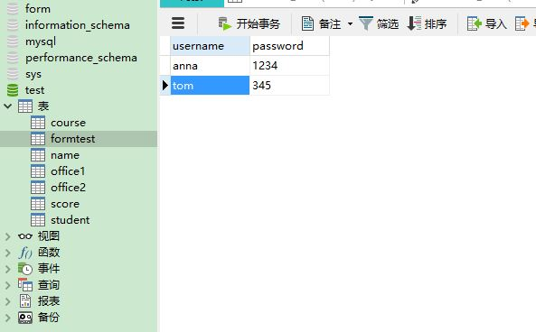

## 2、建立Jframe

* 新建一个工程,并导入mysql-connector-java-5.1.44-bin.jar

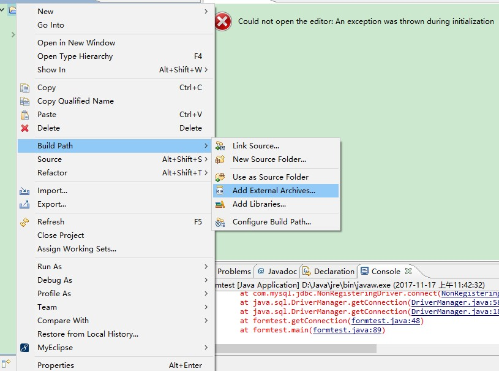

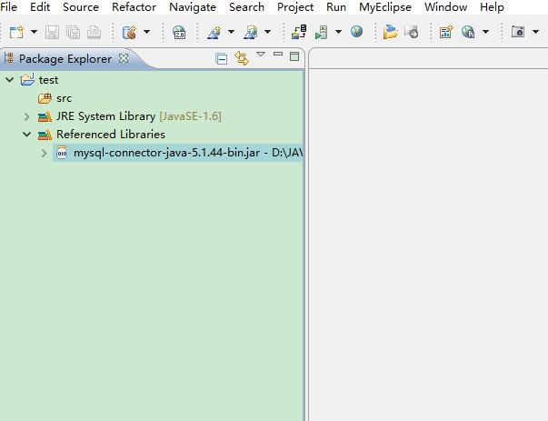

* 新建一个matisse form

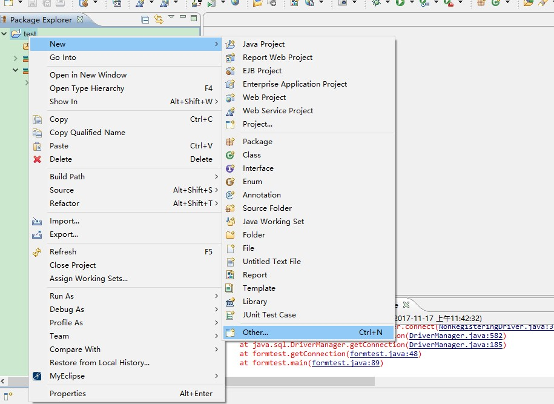

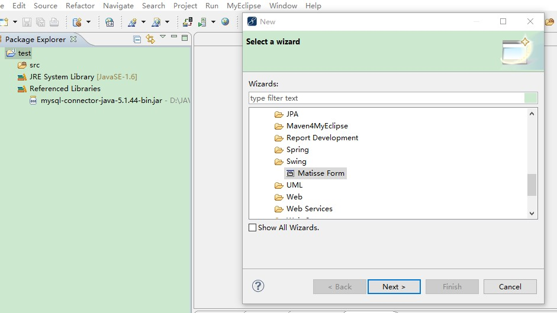

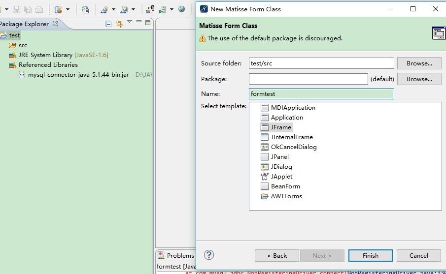

代码如下：
```
import java.awt.Color;
import java.awt.Container;
import java.awt.event.ActionEvent;
import java.awt.event.ActionListener;
import java.sql.Connection;
import java.sql.DriverManager;
import java.sql.PreparedStatement;
import java.sql.ResultSet;
import java.sql.SQLException;
import java.sql.Statement;

import javax.swing.JButton;
import javax.swing.JFrame;
import javax.swing.JLabel;
import javax.swing.JPasswordField;
import javax.swing.JTextArea;
import javax.swing.JTextField;

public class formtest extends JFrame {
    public final static JTextField tUsername = new JTextField();
    public final static JPasswordField password = new JPasswordField();
    public final static JTextArea taInfo = new JTextArea();
    public final static JButton bQuery = new JButton("查询");
    public final static JButton bInsert = new JButton("添加");
    public final static JButton bUpdate = new JButton("更新");
    public final static JButton bDelete = new JButton("删除");
    static Connection con;
    static Statement sta;
    static PreparedStatement pst;// 预处理，提高访问数据库的速度，动态访问数据
    static ResultSet res;
    static final String url = "jdbc:mysql://localhost:3306/studentsystem";
    static final String user = "root";
    static final String password1 = "";
    public Connection getConnection() {
        try {
            // 加载数据库驱动
            Class.forName("com.mysql.jdbc.Driver");
            System.out.println("数据库驱动加载成功");// 测试
        } catch (Exception e) {
            e.printStackTrace();
        }
        // 通过访问数据库的URL获取数据库连接对象
        try {
            con = DriverManager.getConnection(url, user, password1);
            System.out.println("数据库连接成功");
        } catch (Exception e) {
            e.printStackTrace();
        }
        return con;
    }
    public formtest() {
        Container c = getContentPane();
        c.setLayout(null);//结构显示面板    
        tUsername.setBounds(20, 20, 300, 20);
        password.setBounds(20, 50, 300, 20);
        bQuery.setBounds(40, 80, 60, 20);
        bInsert.setBounds(105, 80, 60, 20);
        bUpdate.setBounds(170, 80, 60, 20);
        bDelete.setBounds(235, 80, 60, 20);
        taInfo.setBounds(20, 110, 500, 300);
        // taInfo.setBackground(Color.green);
        c.add(tUsername);
        c.add(password);
        c.add(bQuery);
        c.add(bInsert);
        c.add(bUpdate);
        c.add(bDelete);
        c.add(taInfo);
    }
    /**
     * @param args
     */
    public static void main(String[] args) {
        // TODO Auto-generated method stub
        formtest fr = new formtest();
        //frame.setDefaultCloseOperation(JFrame.EXIT_ON_CLOSE);
        fr.setSize(600, 500);
        //frame.setLocation(200, 100);
        fr.setVisible(true);
        // 与数据库建立连接
        fr.getConnection();
        bQuery.addActionListener(new ActionListener() {// 查询
            @Override
            public void actionPerformed(ActionEvent e) {
                // TODO Auto-generated method stub
                try {
                    // 实例化Statement对象  创建语句
                    sta = con.createStatement();
                    // 执行SQL语句，返回结果集
                    res = sta.executeQuery("select * from userinfo");
                    String info = "";
                    while (res.next()) {
                        //String id = res.getString("id");
                        String name = res.getString("username");
                        String password2 = res.getString("password");
                        info +=  " 用户名：" + name + ", 密码:"
                                + password2 + "\n";
                        taInfo.setText(info);
                        // System.out.println("编号：" + id +", 用户名：" +name +
                        // ", 密码:" + password2);
                    }
                } catch (Exception e1) {
                    e1.printStackTrace();
                } finally {
                    try {
                        if (res != null) {
                            res.close();
                            // con.close();//这句如果不注释的话，当点击查询按钮后数据库连接就会关闭，这时候将无法执行其他的操作
                        }
                    } catch (SQLException e1) {
                        // TODO Auto-generated catch block
                        e1.printStackTrace();
                    }
                }
            }
        });
        bInsert.addActionListener(new ActionListener() {// 添加
            @Override
            public void actionPerformed(ActionEvent e) {
                // TODO Auto-generated method stub
                String strUsername = tUsername.getText().toString();
                String strPassword = password.getText().toString();
                try {// 利用预处理语句添加信息
                    String formtest = "insert into userinfo (username,password) values(?,?)";
                    pst = con.prepareStatement(formtest);
                    // 设置通配符的值
                    pst.setString(1, strUsername);
                    pst.setString(2, strPassword);
                    pst.executeUpdate();// 更新数据
                } catch (Exception e1) {
                    e1.printStackTrace();
                }
            }
        });
     bUpdate.addActionListener(new ActionListener() {// 更新
            @Override
            public void actionPerformed(ActionEvent e) {
                // TODO Auto-generated method stub
                String formtest2 = "update formtest set password =? where username = ?";
                try {
                    pst = con.prepareStatement(formtest2);
                    pst.executeUpdate();
                } catch (SQLException e1) {
                    // TODO Auto-generated catch block
                    e1.printStackTrace();
                }
            }
        });      
        bDelete.addActionListener(new ActionListener() {// 删除
            @Override
            public void actionPerformed(ActionEvent e) {
                // TODO Auto-generated method stub
               // String sql = "delete from formtest where username =? ";
                try {
                    //下面的两种方法
              pst = con.prepareStatement(sql);//预处理语句
                pst.executeUpdate();
                    sta = con.createStatement();
                    sta.executeUpdate(sql);
                } catch (SQLException e1) {
                    // TODO Auto-generated catch block
                    e1.printStackTrace();
                }
            }
        });
    }
}
```

## 3、运行结果

* 点击“查询”出现以下结果

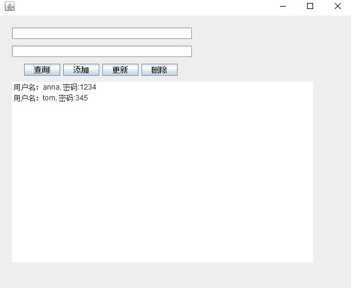

* “添加”以下内容

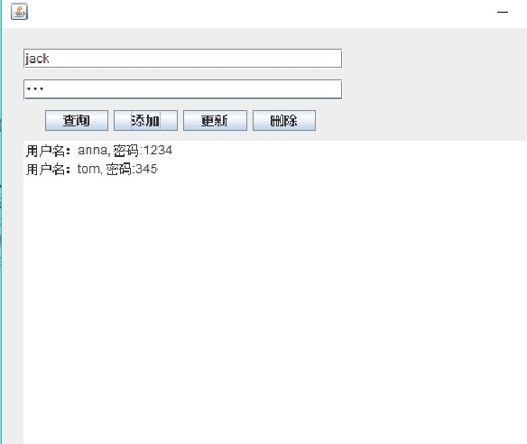

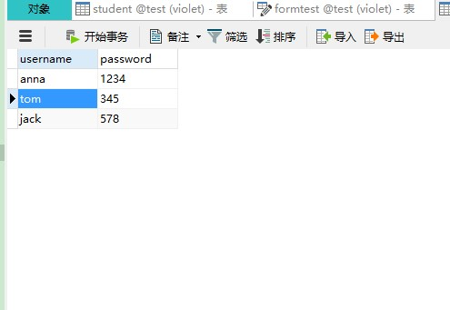

* 把“anna”的密码改成“5678”

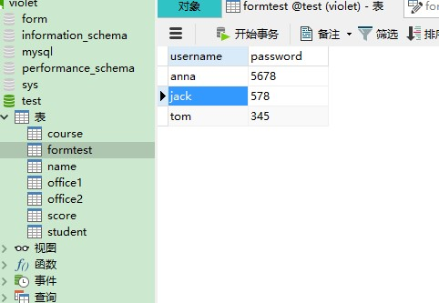

* 把“tom”这一行删了

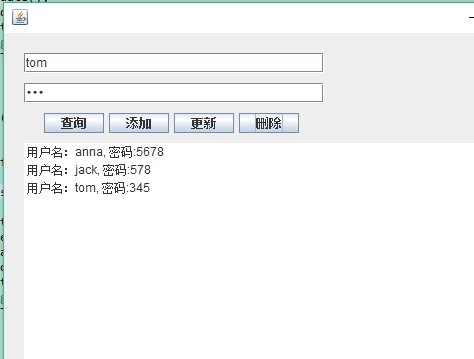

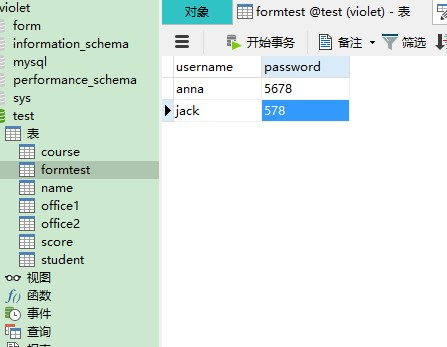


