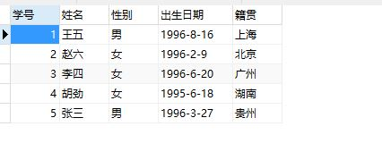
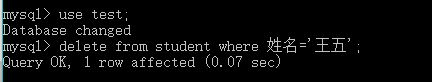
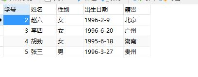
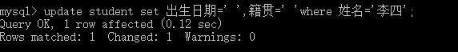
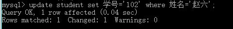
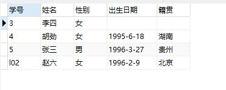
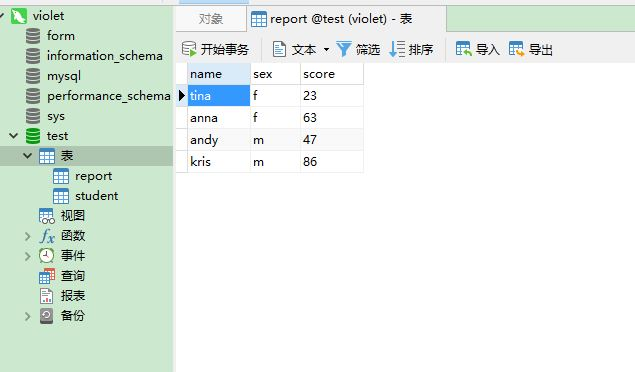
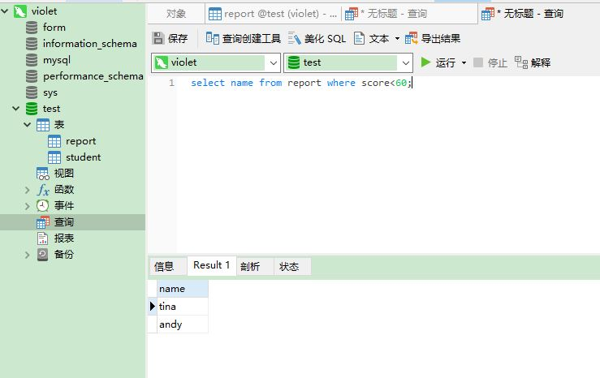
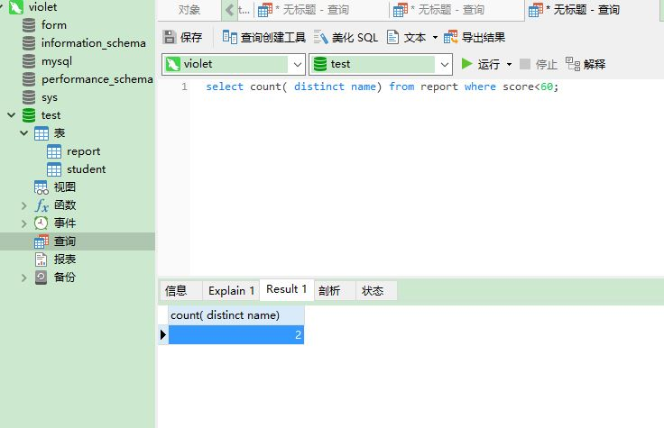

# 关于mysql的详细使用说明

## 一、删除表中数据

1、不可只删除其中一个数据（只能改），如用“delete from 表名 where 条件”就会删除一整行内容。

2、如要删除其中一个数据，要使用“修改”功能。用“update 表名 set 出生日期=' ',籍贯=' 'where 姓名='李四'”

如将学号为“2”的改成“l02”,用“update student set 学号='l02' where 姓名='赵六';”

## 二、查询数据

比如，查询考试成绩需要补考的姓名和人数

### （1）、查询姓名

“select name from report where score<60;”

(“name”是要查询的姓名，“report”是表名，“score”则是学生的成绩)

### （2）、查询人数

“select count(distinct name) from report where score<60;”

