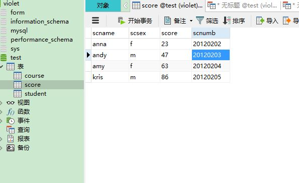
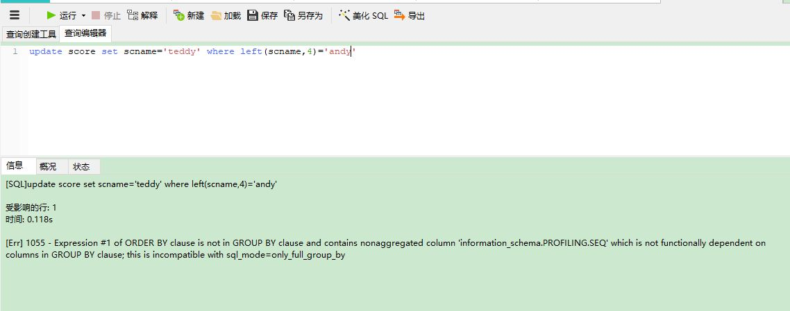
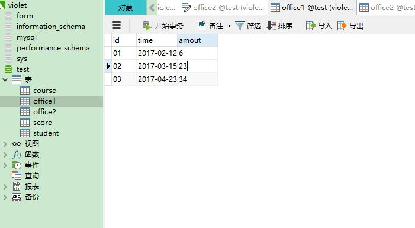
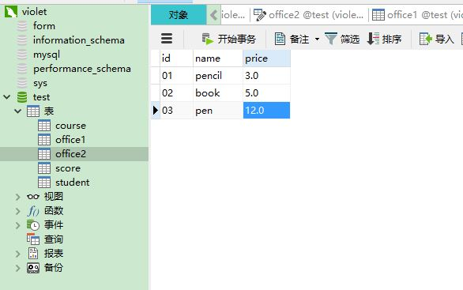
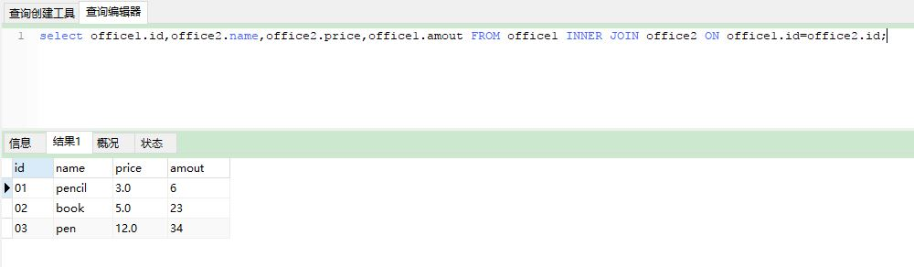
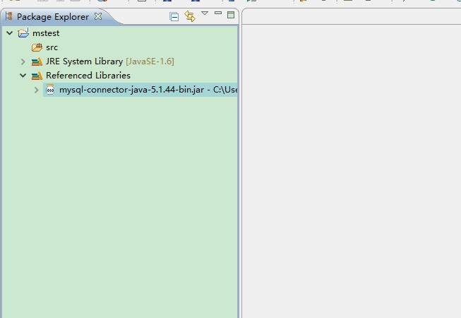
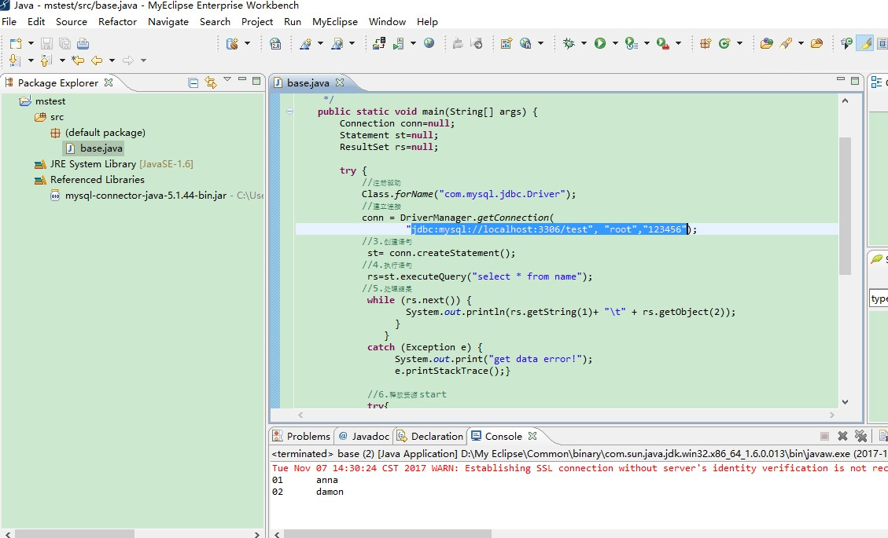

# Mysql使用过程<三>
### 1、关于insert

* 如所有字段都要插入数据

* 则不必像之前“insert into 表名(字段1，字段2,...字段n) values(值1，值2,...值n)” 

* 而直接简单的写“insert into 表名（字段1,字段2,...字段n） values(值1,值2,...值3)”

### 2、关于LEFT函数

* 用于只修改字符中的部分内容或全部内容


要把数据表中“andy”的名字改为“teddy”
然后在“查询”-“新建查询”里打开并输入以下代码


### 3、关于表与表之间的联系

* 建立office1



* 建立office2



* 输入“select 表1.字段1,表1.字段2,表2.字段1，... FROM 表1 INNER JOIN 表2 ON 表1.相同字段=表2.相同字段;”



### 4、把数据库的表导入到ecipse

* 新建java project

* 导入mysql-connector-java-5.1.44-bin.jar




* 建立一个class

* 导入写好的代码



#### 注意：

1、“"jdbc:mysql://localhost:3306/test", "root","123456"”里的“test”是自己建立的数据库，“root”是用户名，“123456”是密码
2、“"select * from name"”里的name是表名

* 代码如下：
```java
import java.sql.*;

public class base {

   /**
 * @param args
     */
    public static void main(String[] args) {
        Connection conn=null;
        Statement st=null;
        ResultSet rs=null; 
        try {
         //注册驱动
         Class.forName("com.mysql.jdbc.Driver");
        //建立连接
         conn = DriverManager.getConnection(
        "jdbc:mysql://localhost:3306/test", "root","123456");
//3.创建语句
st= conn.createStatement();
//4.执行语句
 rs=st.executeQuery("select * from name");
//5.处理结果 
        while (rs.next()) {
                    System.out.println(rs.getString(1)+ "\t" + rs.getObject(2));
                  }
                }
             catch (Exception e) {
                  System.out.print("get data error!");
                  e.printStackTrace();}
                
//6.释放资源 start
     try{
        if(rs != null)
         rs.close();
        } catch (SQLException e) {
             e.printStackTrace();
                    }finally{
                      try{
                    if(st != null)
                       st.close();
                      } catch (SQLException e) {
                        e.printStackTrace();
                      }finally{
                    if(conn != null)
                       try{
                        conn.close();
                      } catch (SQLException e) {
                        e.printStackTrace();
                }
              }
            }
            //6.释放资源 over     
   }    
}
```


