# MySQL使用过程说明

## 一、打开mysql

配置好Mysql后，有可能你把它的自启动关闭了导致会出现“mysqlCan't connect to MySQL server on 'localhost' (10061)”这样的文字，这就需要我们去把它打开。

首先。找到控制面板，打开“管理工具”

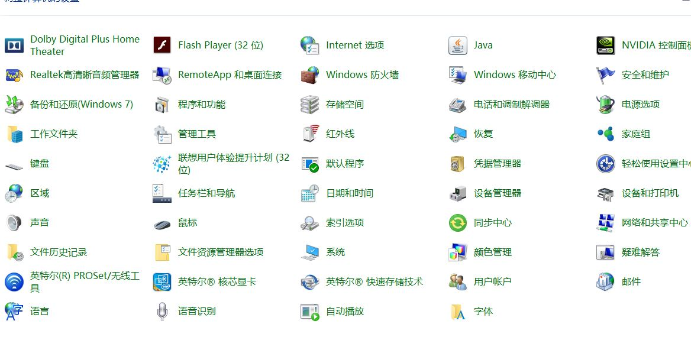 

然后打开“服务”

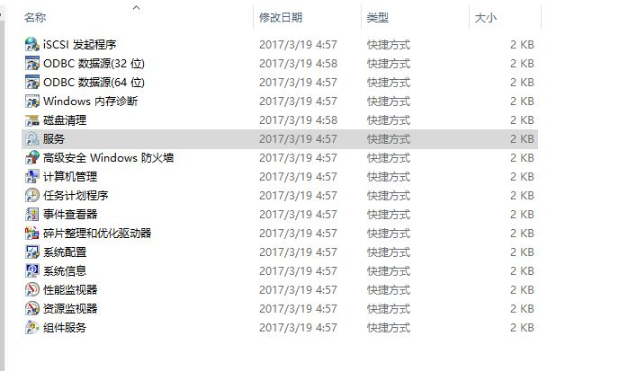

启动MYSQL服务

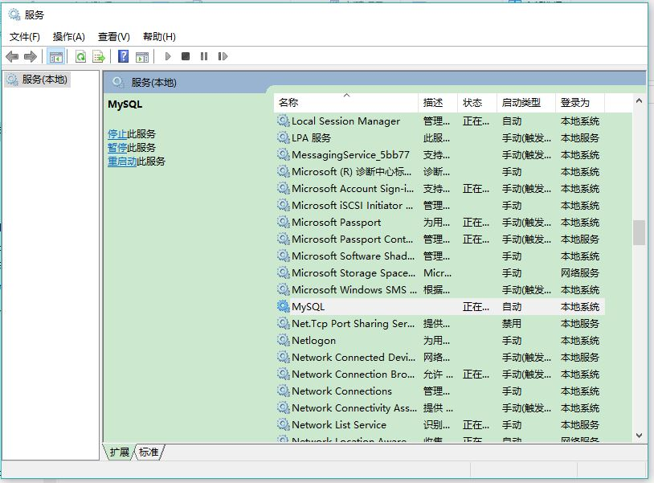

## 二、修改mysql密码

## 在记得密码的情况下

### 1、（错误的方法） 

（1）连接权限数据库： use mysql; 。

（2）改密码：update user set password=password("123456") where user="root";（别忘了最后加分号） 。

（3）刷新权限（必须步骤）：flush privileges;　。

（4）退出 quit。

 （5）注销系统，再进入，使用用户名root和刚才设置的新密码123登录。 
 
 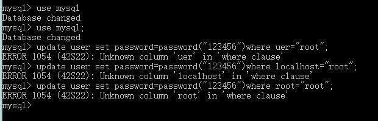

### 2、（错误的方法）

（1） 首先登录MySQL。

（2）mysql> use mysql；

（3）mysql> update user set password=password('123456') where user='root' and host='localhost'；

（4）mysql> flush privileges；

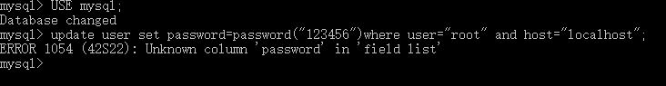

### 3、（错误的方法）

mysqladmin -u用户名 -p旧密码 password 新密码 

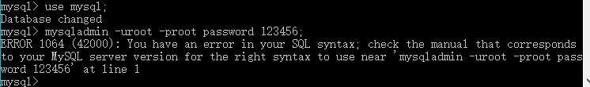

### 4、（正确的方法）

set password=password('123456');
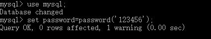

## 在不记得密码的情况（系统会随机分配密码）

(1)停止mysqld服务。在cmd命令行中输入“net stop mysql”

（2）启动会跳过输入密码检查的mysqld。

在命令行中输入“mysqld --skip-grant-tables”

（3）进入mysql数据库。“mysql -uroot”

（4）修改密码“'update mysql.user set authentication_string=PASSWORD('123456') where User='root';'FLUSH PRIVILEGES;
mysqladmin -u root -p shutdown”

## 三、进入Mysql创建表格

首先进入mysql ,“mysql -u root -p”

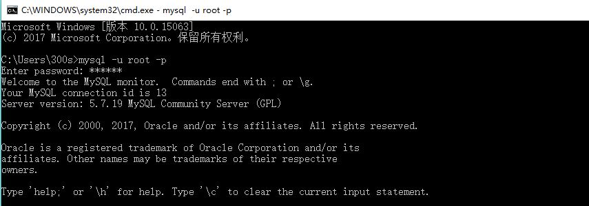

* 因为代码不支持中文写法，所以我们必须先设置成中文。

* 首先“show variables like'%char%';”看到数据库和服务器都不是中文

* 然后把charcter_set_database和character_set_server都设置成utf8

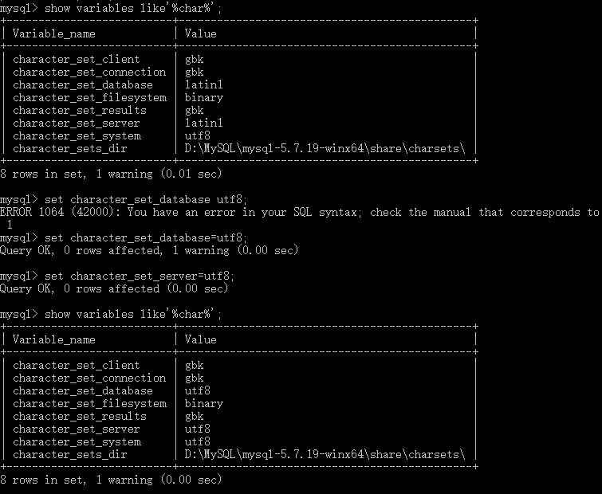

* 建数据库“test”，"create database test;"

* 在数据库下建表格“student”,"use test" “create table student(学号 varchar(20) not null,)”

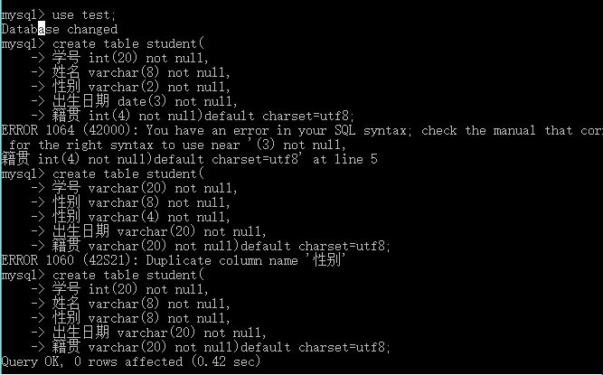

* 插入内容“insert into student ( field1, field2,...fieldN )values( value1, value2,...valueN );”

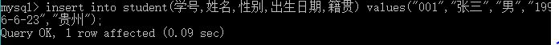 

* 填好内容后，查看表格“select *from student”

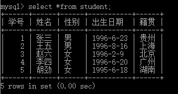

