# 小众软件：PURE天气的使用过程

## PURE天气和华为系统天气对比

### 1、天气温度显示
华为系统天气温度
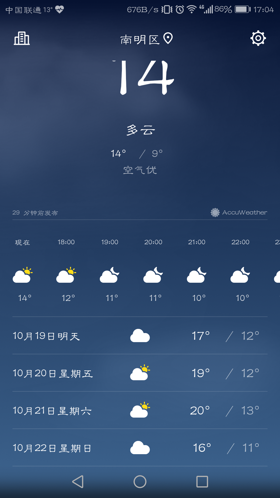

pure天气温度显示
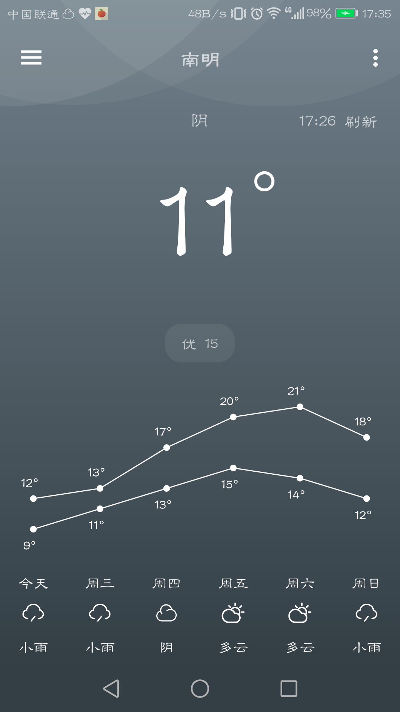

### 2、空气质量、舒适度对比
华为系统
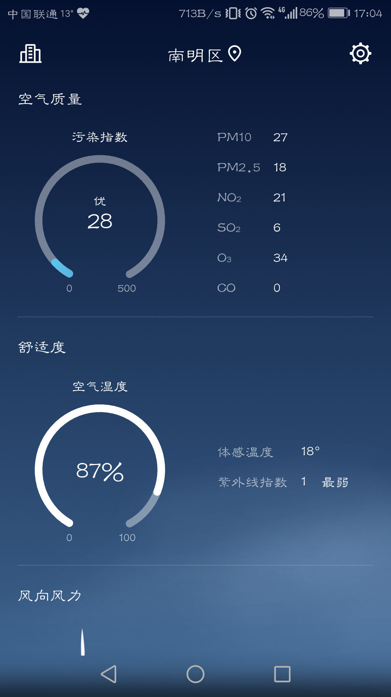

pure天气
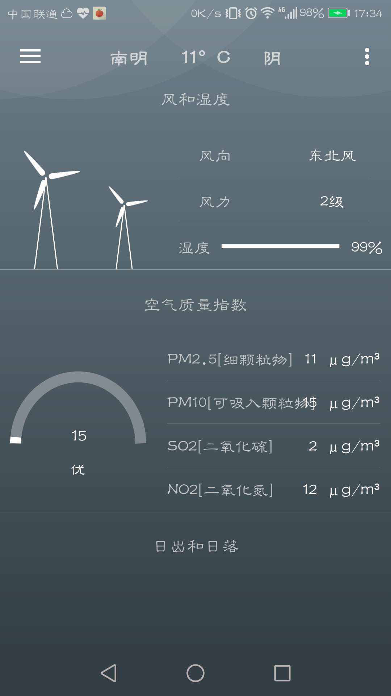

### 3、风力预报
华为系统
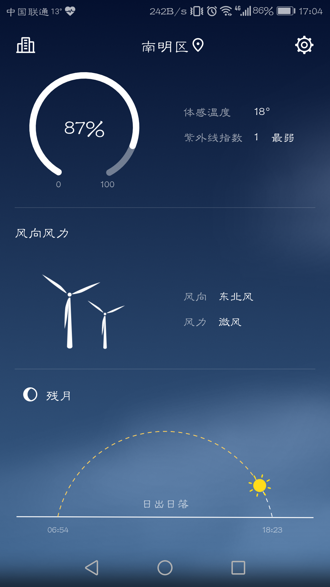

pure天气
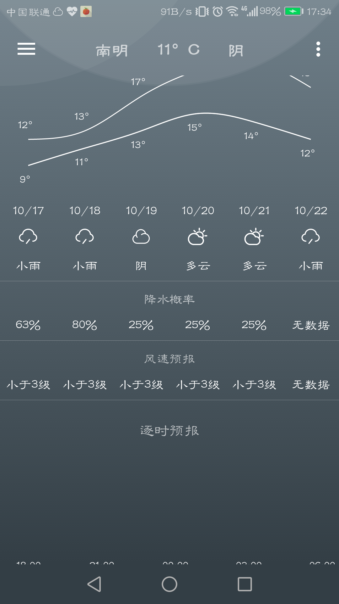

## PURE天气的特别功能
### 1、穿衣、化妆、洗车、运动等指数
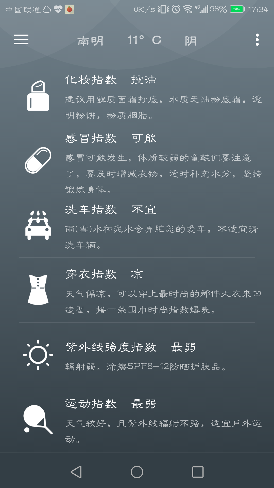

### 2、可以设置早晨提醒时间
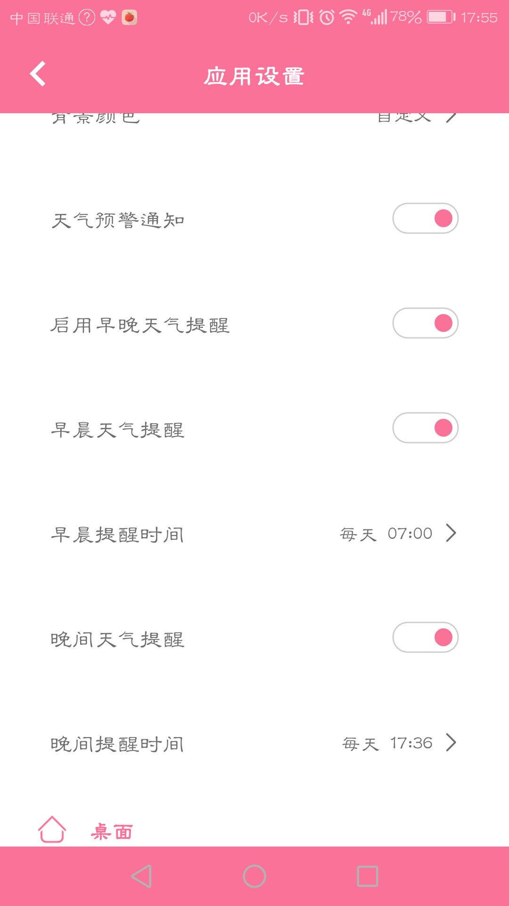

### 3、设置动态壁纸
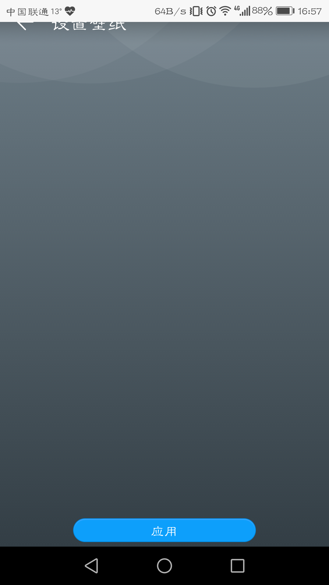

### 4、可预览动态背景
有晴、多云、阴、雾、雨、雨、雨夹雪、雪、霾
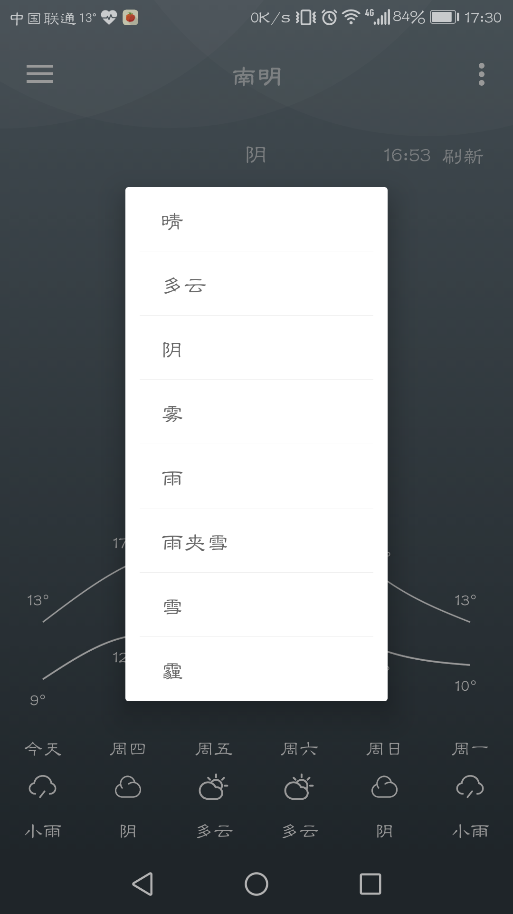

### 5、温度曲线、折线
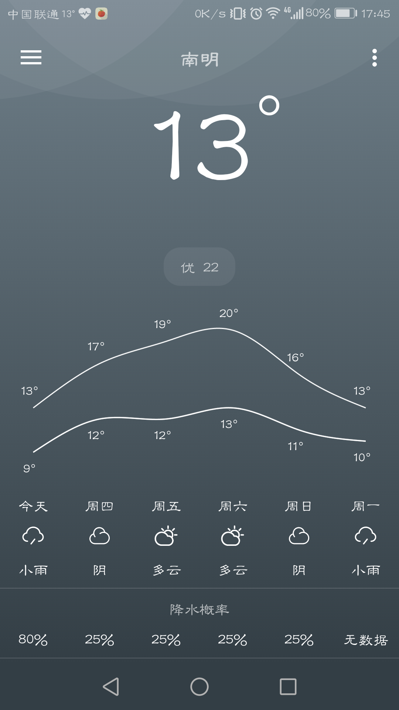

### 6、后台更新频率设置
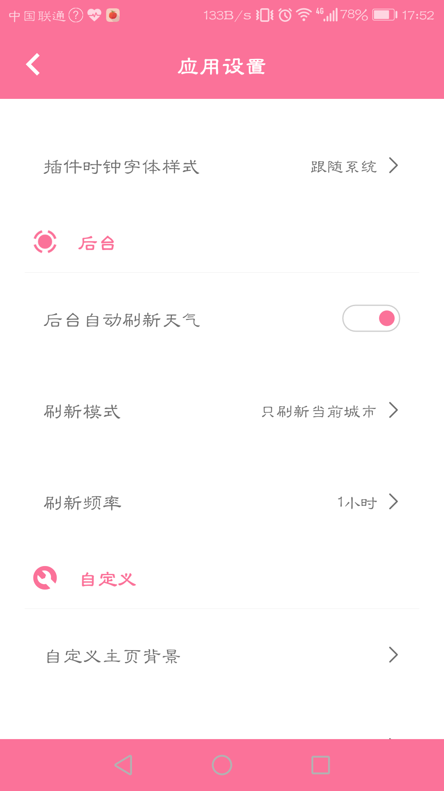

### 7、通知栏设置
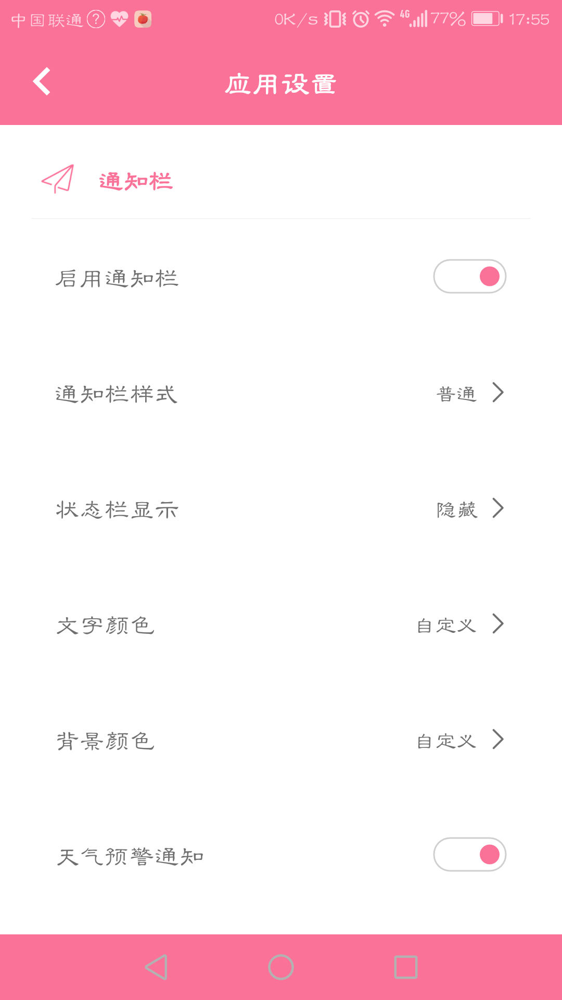

