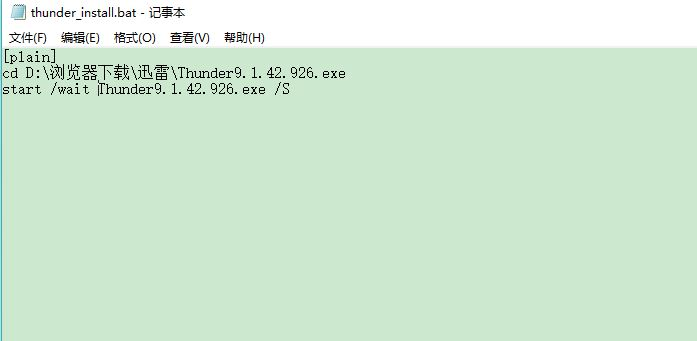
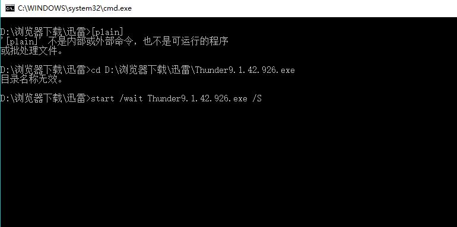

# 关于批处理文件自动安装软件的说明

## 一、批处理文件定义

* 批处理，顾名思义就是进行批量的处理。批处理文件是扩展名为·bat 或·cmd的文本文件，包含一条或多条命令，由DOS或Windows系统内嵌的命令解释器来解释运行。

## 二、自动安装软件

以安装迅雷为例
* 在浏览器下载迅雷，并在文件夹里新建一个bat格式的文件，名字可写“thunder_install”

* 由于迅雷的文件名是“Thunder9.1.42.926.exe”

* 迅雷安装的地址是“D:\浏览器下载\迅雷\Thunder9.1.42.926.exe”

* 编辑文件输入以下代码“[plain]
                        cd D:\浏览器下载\迅雷\Thunder9.1.42.926.exe
                       start /wait Thunder9.1.42.926.exe /S”
（注意：wait和软件名后面要有空格）

* 双击bat文件，软件就可自动安装了

