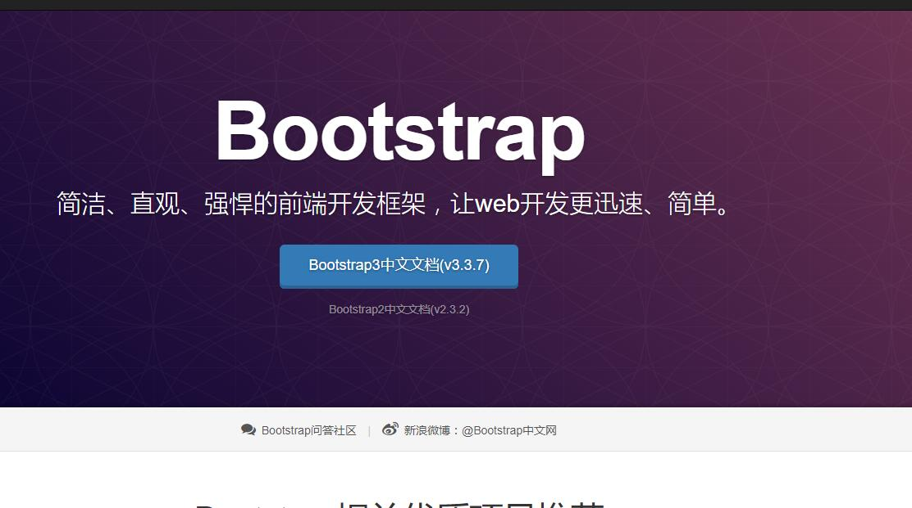
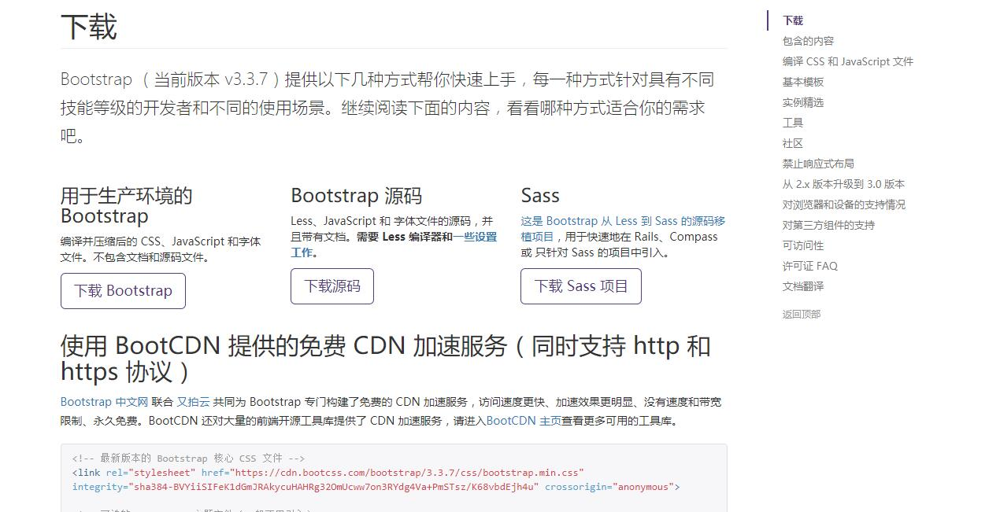
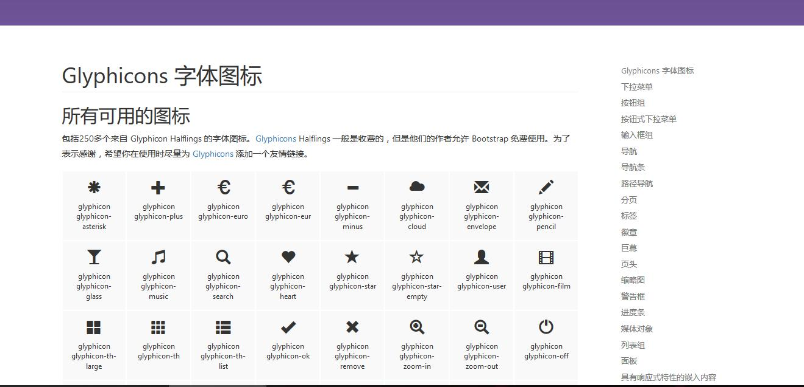
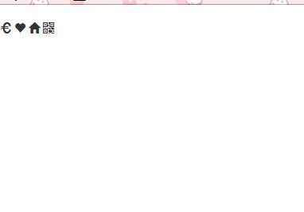
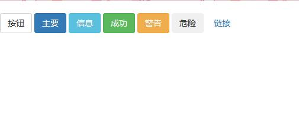
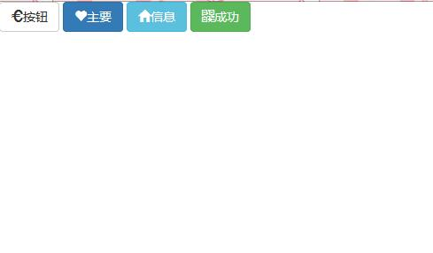

# BOOTSTRAP-如何使用字形图标

## 1、下载使用BOOTSTRAP

1.在浏览器搜索[bootstrap中文网](http://www.bootcss.com/)

2.点击***BOOTSTARP3中文文档***



3.点击**下载BOOTSTRAP**


4.点击**下载BOOTSTRAP**就可下载bootstrap的完整框架了



5.新建一个文件夹里面把bootstrap下载好的文件全部放进去，再建立一个html的文件

6.开始在新建的html文件里写内容

## 2、字体图标

* 找到**组件**并点击，然后就可以看到字体图标的样式了




* 具体使用```<span class="glyphicon glyphicon-search"></span>```

* 完整代码如下：
```
<!DOCTYPE html>
<html lang="zh-CN">
  <head>
    <meta charset="utf-8">
    <!-- <meta http-equiv="X-UA-Compatible" content="IE=edge"> -->
    <!-- <meta name="viewport" content="width=device-width, initial-scale=1"> -->
    <!-- 上述3个meta标签*必须*放在最前面，任何其他内容都*必须*跟随其后！ -->
    <title>bootstrap</title>

    <!-- Bootstrap -->
    <link href="css/bootstrap.min.css" rel="stylesheet">
  </head>
  <body>
    <h1></h1>
    <span class="glyphicon glyphicon-euro"></span>
    <span class="glyphicon glyphicon-heart"></span>
    <span class="glyphicon glyphicon-home"></span>
    <span class="glyphicon glyphicon-qrcode"></span>
    <!-- jQuery (necessary for Bootstrap's JavaScript plugins) -->
    <script src="https://cdn.bootcss.com/jquery/1.12.4/jquery.min.js"></script>
    <!-- Include all compiled plugins (below), or include individual files as needed -->
    <script src="js/bootstrap.min.js"></script>
  </body>
</html>
```
 
* 显示效果如下：



## 2、按钮

* 具体使用```<button type="button" class="btn btn-default">```

* 完整代码如下：

```
<!DOCTYPE html>
<html lang="zh-CN">
  <head>
    <meta charset="utf-8">
    <!-- <meta http-equiv="X-UA-Compatible" content="IE=edge"> -->
    <!-- <meta name="viewport" content="width=device-width, initial-scale=1"> -->
    <!-- 上述3个meta标签*必须*放在最前面，任何其他内容都*必须*跟随其后！ -->
    <title>bootstrap</title>

    <!-- Bootstrap -->
    <link href="css/bootstrap.min.css" rel="stylesheet">
  </head>
  <body>
    <!-- jQuery (necessary for Bootstrap's JavaScript plugins) -->
    <script src="https://cdn.bootcss.com/jquery/1.12.4/jquery.min.js"></script>
    <!-- Include all compiled plugins (below), or include individual files as needed -->
    <script src="js/bootstrap.min.js"></script>
    <button type="button" class="btn btn-default">按钮</button>
    <button type="button" class="btn btn-primary">主要</button> 
    <button type="button" class="btn btn-info">信息</button> 
    <button type="button" class="btn btn-success">成功</button>
    <button type="button" class="btn btn-warning">警告</button> 
    <button type="button" class="btn btn-dangerous">危险</button> 
    <button type="button" class="btn btn-link">链接</button> 
  </body>
</html>
```

* 显示效果如下：



## 3、字体图标（将图标和按钮结合）

* 代码如下：

```
<!DOCTYPE html>
<html lang="zh-CN">
  <head>
    <meta charset="utf-8">
    <!-- <meta http-equiv="X-UA-Compatible" content="IE=edge"> -->
    <!-- <meta name="viewport" content="width=device-width, initial-scale=1"> -->
    <!-- 上述3个meta标签*必须*放在最前面，任何其他内容都*必须*跟随其后！ -->
    <title>bootstrap-如何使用字形图标</title>

    <!-- Bootstrap -->
    <link href="css/bootstrap.min.css" rel="stylesheet">
  </head>
  <body>
    
        <button type="button" class="btn btn-default">
         <span class="glyphicon glyphicon-euro"></span>按钮
        </button>
        <button type="button" class="btn btn-primary">
       <span class="glyphicon glyphicon-heart"></span>主要
    </button>
    <button type="button" class="btn btn-info">
    <span class="glyphicon glyphicon-home"></span>信息
    </button>
    <button type="button" class="btn btn-success">
    <span class="glyphicon glyphicon-qrcode"></span>成功
    </button>
    
    <!-- jQuery (necessary for Bootstrap's JavaScript plugins) -->
    <script src="https://cdn.bootcss.com/jquery/1.12.4/jquery.min.js"></script>
    <!-- Include all compiled plugins (below), or include individual files as needed -->
    <script src="js/bootstrap.min.js"></script>
  </body>
</html>
```

* 显示效果如下：




