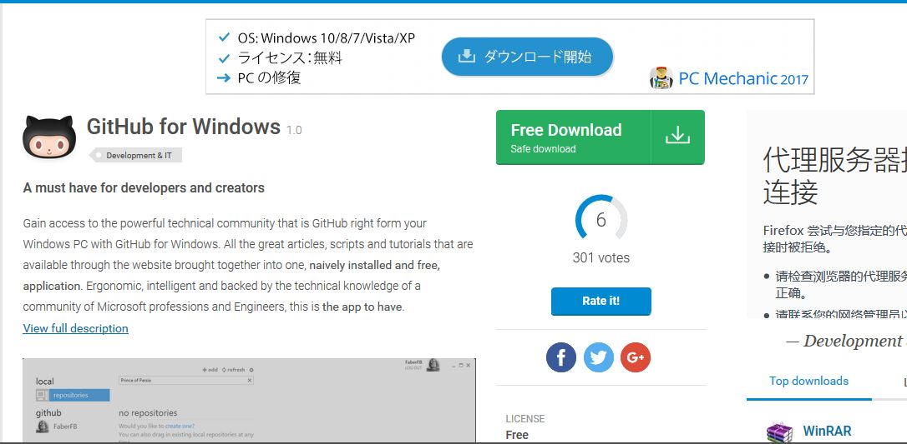
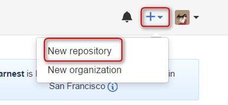
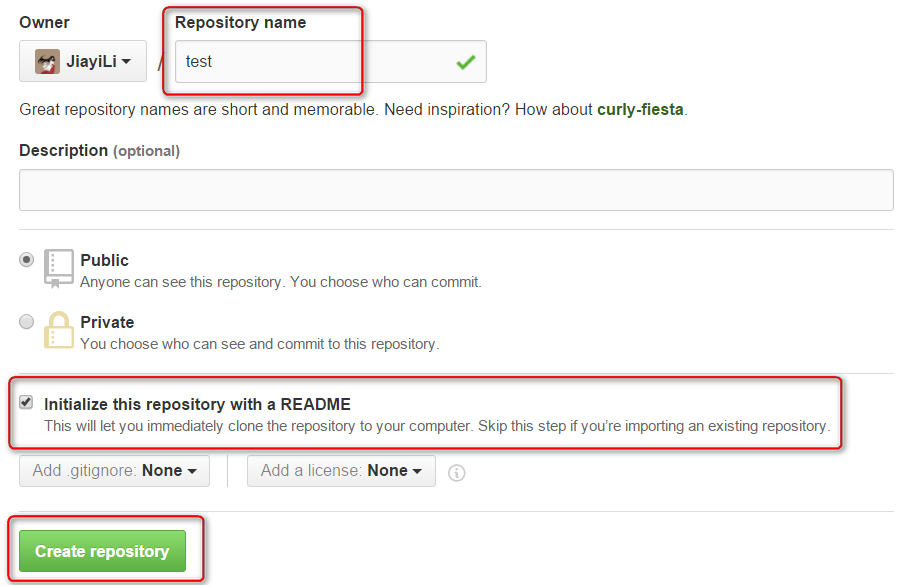
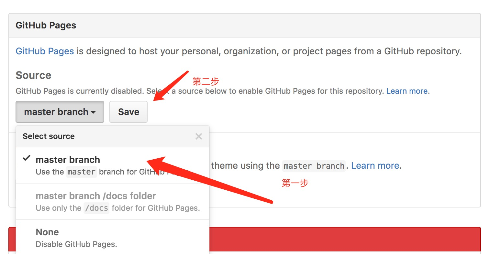
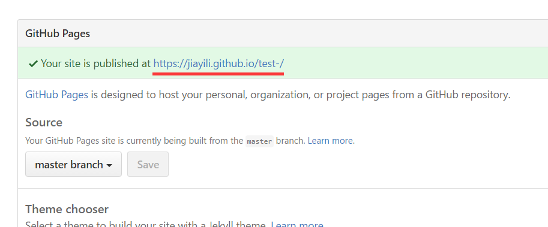
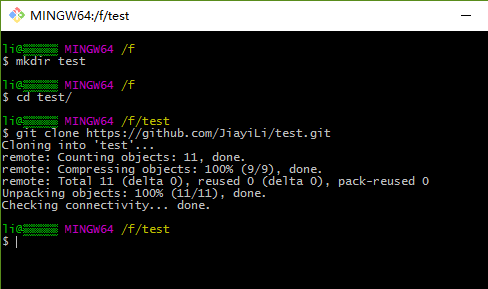
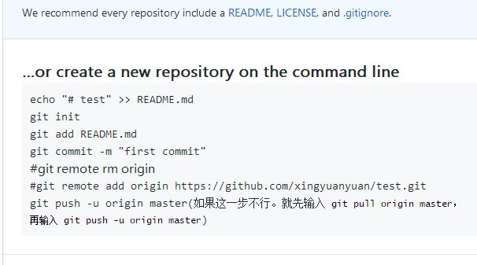
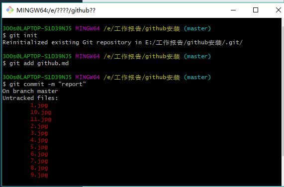

# 一、注册账号

搜索github点击SIGN UP首先注册一个账号

# 二、下载安装github

搜索github for windows,选择github for windows-download。

接着下载安装就可以了。

# 三、安装成功

安装好以后，点击鼠标右键就会出现Git Gui Here和Git Bash Here两个图标，这就是安装好了。

# 四、建立test

登录到Github上，新建一个repo，命名为test，勾选 initialize this repository with a README，点击create repository

打开settings，有一个Github Pages 的设置，点击 source 中的本来的 None ，使其变成 master 分支，也就是作为部署github 
pages 的分支，然后点击 save。

页面刷新之后，再看 github pages 设置框处，多了一行网址，就是你的 github pages 的网址了

以上，test就建好了。

# 五、上传文件

* 选择一个盘，单击右键选择git bash here，然后会出来一个界面。用来在 f 盘创建 test 文件放你的github上的test repository，克隆test repository到 test 文件中。

* 将自己写的网页文件复制在test文件夹里。
接着输入这几步

接下来在打开你的github网页就可以看到你上传的文件了。

# 六、注意事项

 1. 有时候git push -u origin master没用时，就先git pull origin master，再git push -u origin master便可成功。
 
 2.push出错时，可试试 “先按Esc ,再按'shift"+':'，然后输'q!'再回车”
