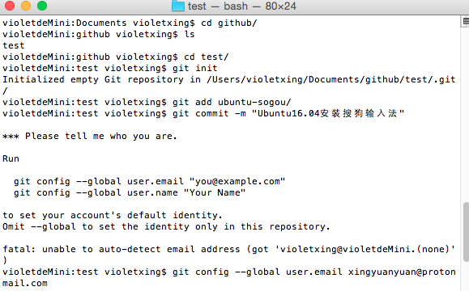
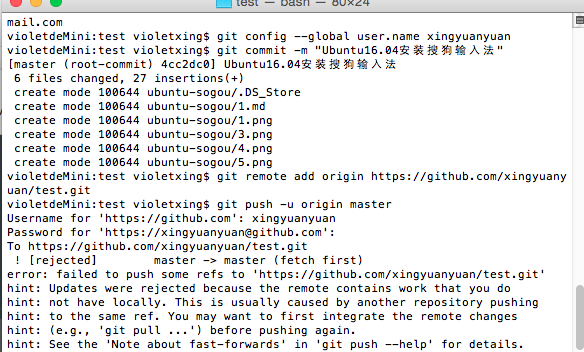
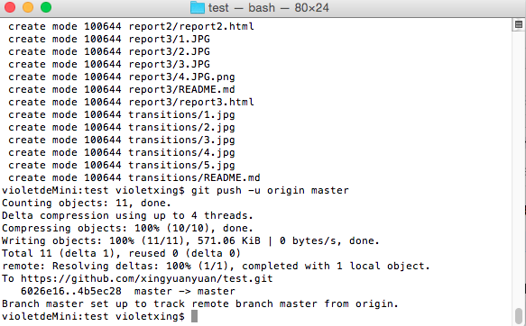
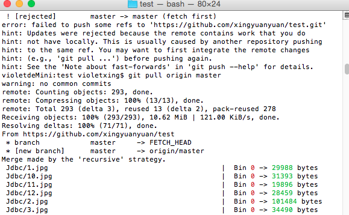

# Mac安装github

1.新建一个github的文件夹，文件夹里再建立一个名为test的文件夹，便于把要上传的文件全部放在这个文件夹里

2.mac里已经安装git，运行下载demo的命令：
```
git clone git@github.com:ruanyf/react-demos.git
```
3.先按照原本push的方法来做，发现失败了



下面有提示输入用户邮箱和用户名，依次输入后才连接到仓库

4.这时候Push是无法成功的





5.必须先pull后才能成功



6.这时候发现test里有之前所有上传到github的文件


