# 在MAC搭建linux虚拟机

1.下载一个visual box,点击“新建”创建一个虚拟机

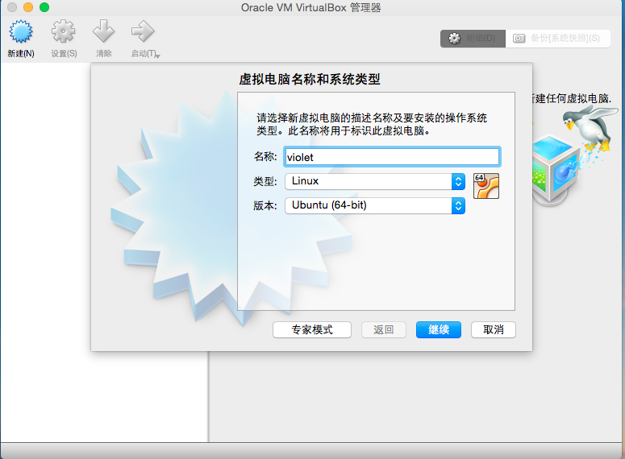

2.给虚拟机分1G的内存

3.创建虚拟硬盘

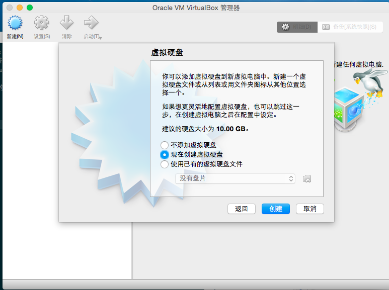

4.使用VDI

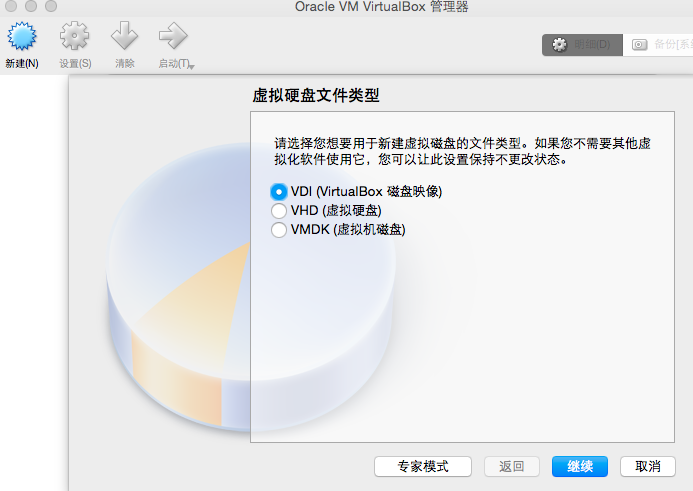

5.设置文件大小

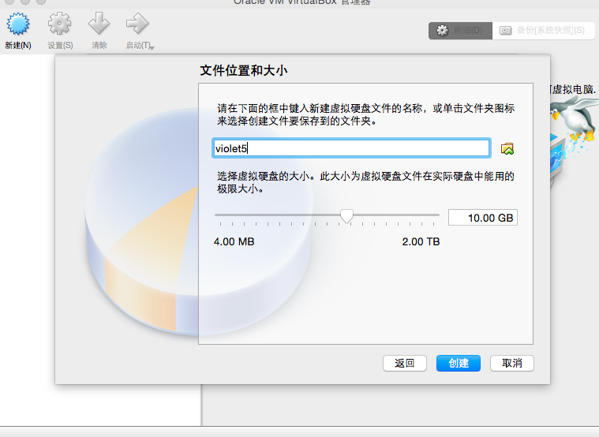

6.设置好后，开始启动

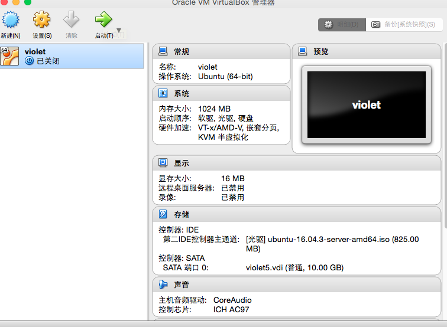

7.找到下载好的Ubuntu16.04镜像（注意：下载的镜像名字需为ubuntu-16.04.2-desktop-amd64.iso）

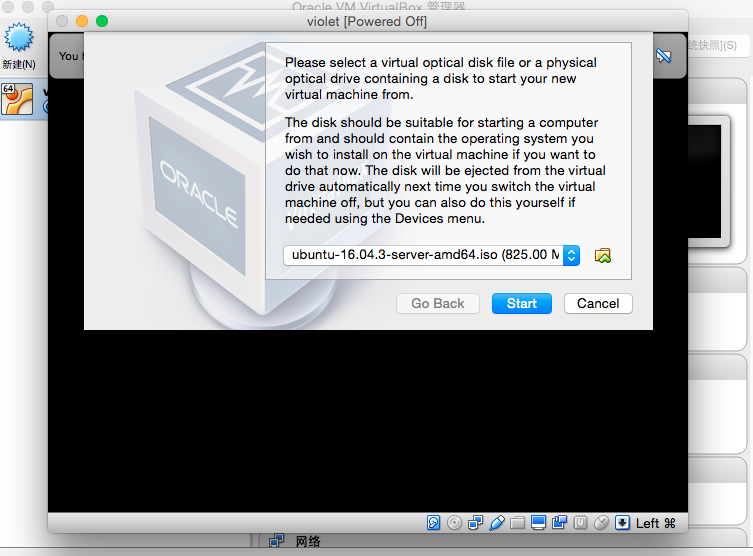

8.安装ubuntu系统

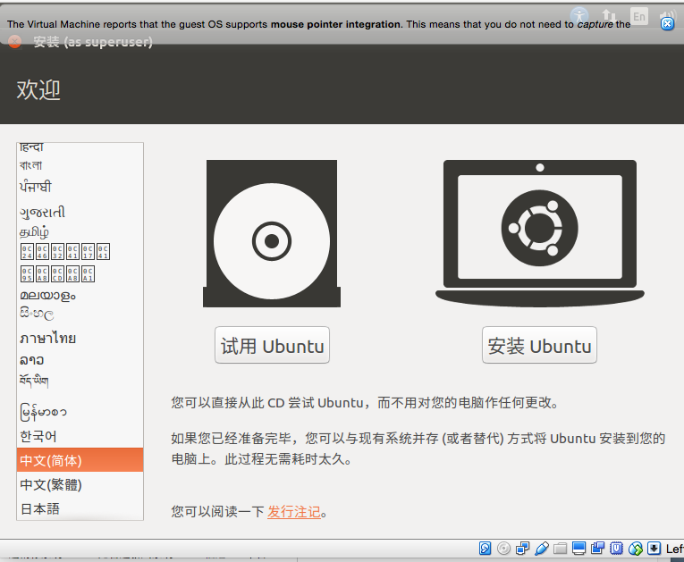

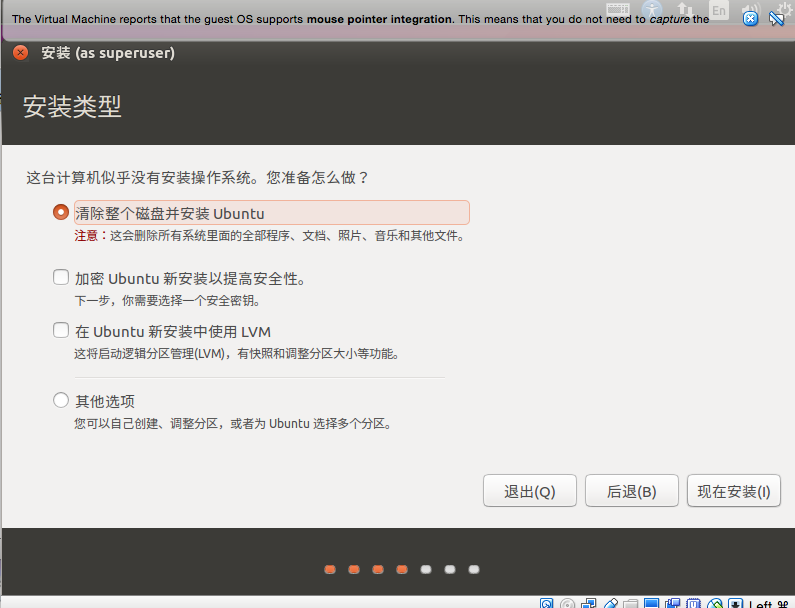

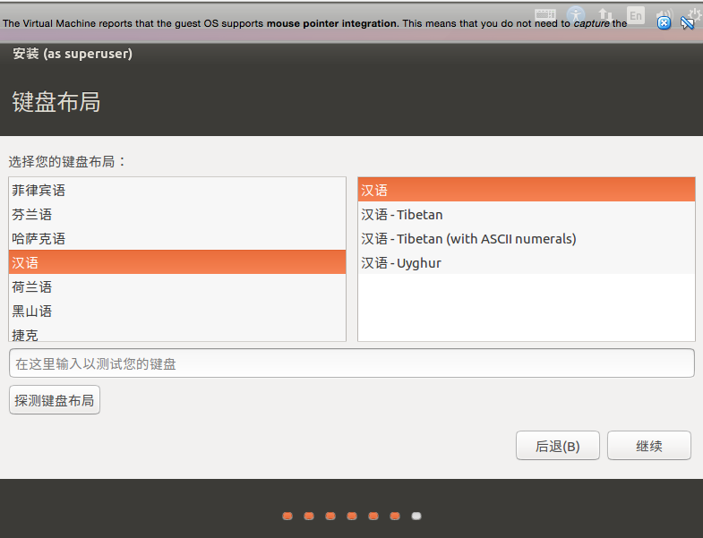

9.安装完毕

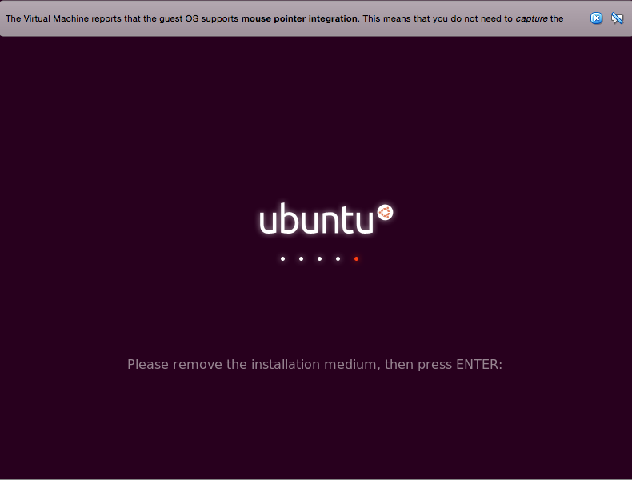

安装好的界面：

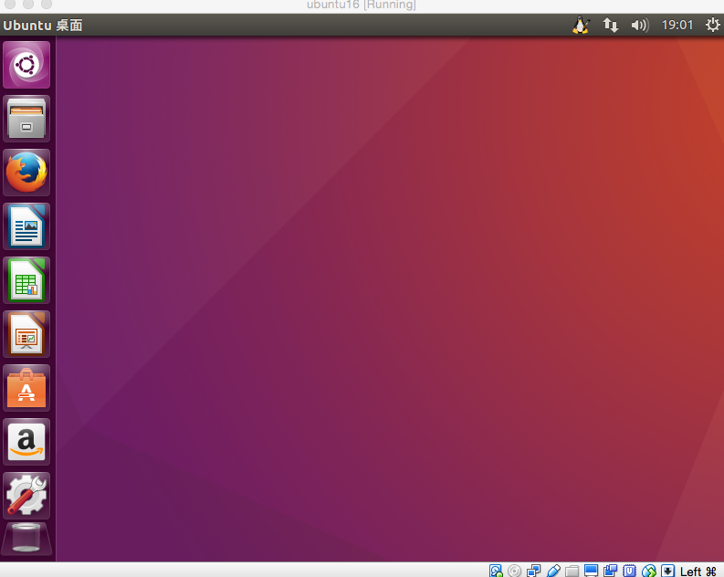

