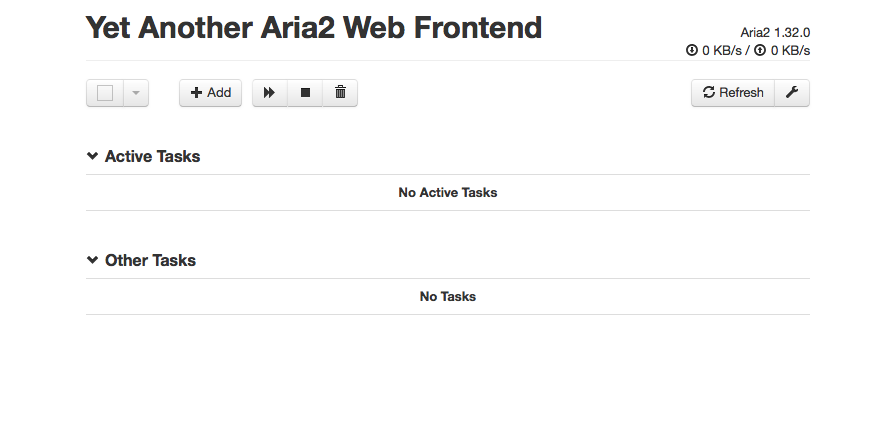
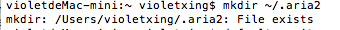
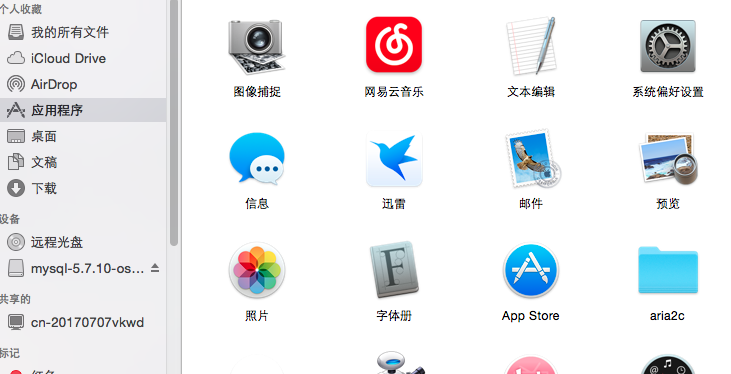
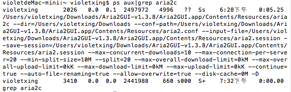
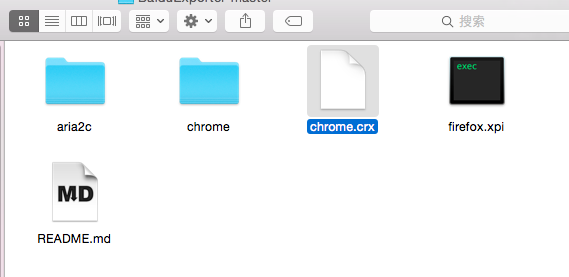
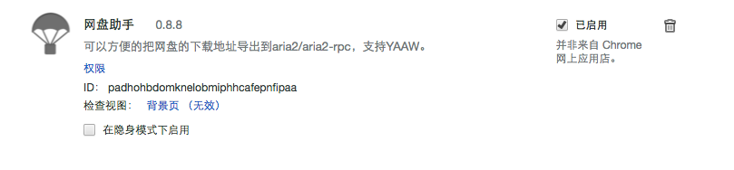
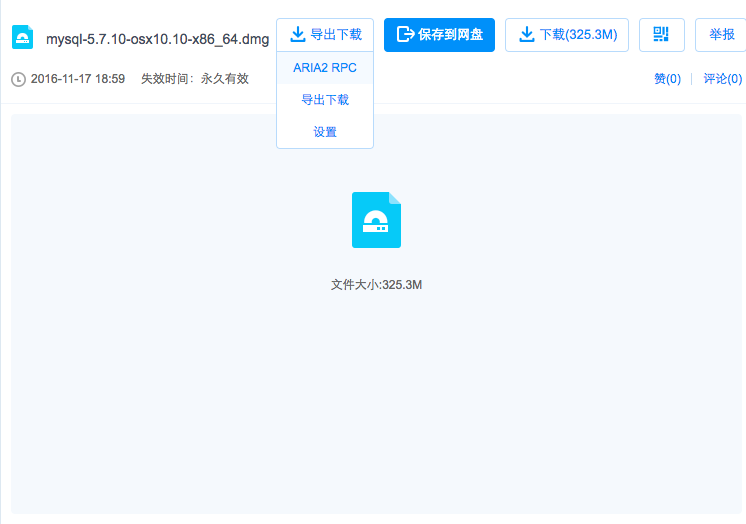
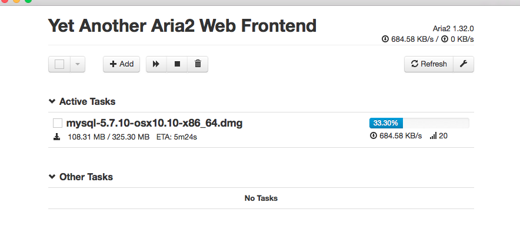

# 关于在mac系统令百度云高速下载的过程

## 1.首先先去搜索教程

我找到的是这篇：

[MacOS使用Aria2下载百度网盘 – 突破百度云盘速度限制满速下载](https://www.isofts.org/macos-aria2-baiduyun/)

## 2.安装aria2

aria2官方主页：[https://github.com/aria2/aria2](https://github.com/aria2/aria2)

安装好的页面如下：



## 3.配置aria2

1.配置文件下载地址：[https://pan.baidu.com/s/1dERmK7J](https://pan.baidu.com/s/1dERmK7J) 密码：0cfp

2.用文本编辑器打开配置文件： aria2.conf

3.修改第二行“dir=/Users/XXX/Downloads”把xxx改成你的用户名

4.打开终端，输入

```
mkdir ~/.aira2
```



5.完成上一步后，用户根目录就好产生一个.aria2，但是是隐藏的，所以我们需要将配置好的文件aira2.conf拖入其中

显示隐藏路径的 Terminal 命令：
```
defaults write com.apple.finder AppleShowAllFiles -boolean true ; killall Finder
```

取消隐藏路径的 Terminal 命令：
```
defaults write com.apple.finder AppleShowAllFiles -bool false ; killall Finder
```


6.下载aria2c文件

下载地址： [http://pan.baidu.com/s/1pLzyqdd](http://pan.baidu.com/s/1pLzyqdd)
密码：mccb

解压后放到应用程序里

7.运行aria2

8.运行aria2，在终端里输入：

```
aria2c
```



9.检查aria2c是否运行,在终端输入：

```
ps aux|grep aria2c
```


## 3.安装chrome浏览器网盘助手的插件

下载网盘助手地址：[http://pan.baidu.com/s/1jIsMSWA](http://pan.baidu.com/s/1jIsMSWA)
密码：xudf

解压后将chrome.crx加入chrome的扩展工具里并运行就可以了






## 4.安装成功后

1.安装成功后的百度云页面就会多一个“导出下载”的组件



2.点击ARIA2 RPC就可以在aria2里面下载你想要的文件了




