# 阿里云域名备案介绍
## 一、准备的信息
1.域名：备案的域名可在阿里云购买，也可在其他域名注册商处购买，因备案核查域名持有者信息，域名持有者需与备案主体保持一致
2.阿里云服务器：目前阿里云可备案的服务器有 ECS（包年包月）、弹性 Web 以及云虚拟主机等，您可根据网站需求进行选择购买
3.证件资料：
个人备案：需要个人身份证正反面原件扫描件；
企业备案：需要企业注册证件原件扫描件、备案负责人身份证正反面原件扫描件、加盖企业公章的核验单。
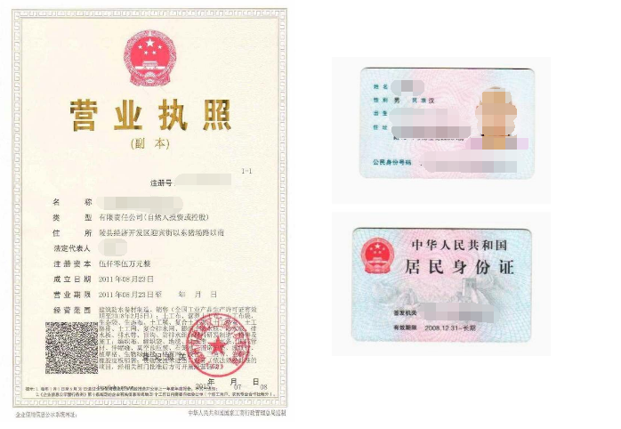
### 备案前先购买阿里云服务器
您域名想通过阿里云备案，请先购买阿里云服务器，然后登录阿里云备案平台提交申请。 
若需购买阿里云服务器，请在 购买 页面选择需要的配置，在线提交订单即可购买
如您使用的是自己的服务器（自建服务器或自建机房）备案，需要联系网络提供商进行备案，如联通、电信等。
## 二、提交备案初审流程
请先确认已购买阿里云主机或阿里云云虚拟服务器，购买产品后才能登录备案系统提交备案申请，信息提交至初审状态后，工作人员会在1 个工作日内进行审核，此过程中可能会拨打备案信息中的联系电话核实信息，也请您保持电话畅通。
### 1、登录备案系统
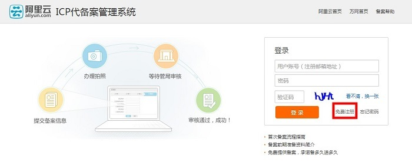
### 2、免费注册登录账号。
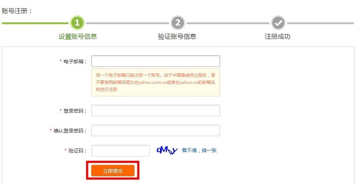
### 3、进入邮箱查看邮件

### 4.验证备案类型。账号激活成功后，进入 备案系统，填写备案的域名及主体证件信息，系统会通过域名及证件号码判断此次操作的备案类型
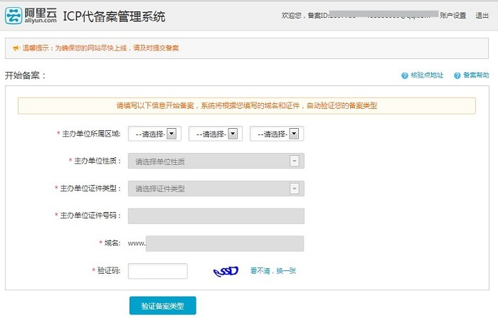
### 5、填写产品信息验证。产品不同，验证方式也不同.
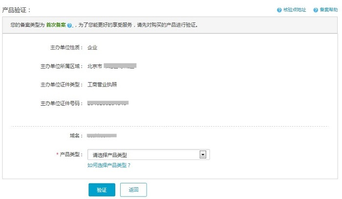
#### 产品验证详情
1、购买阿里云 ECS 服务器后，登录管理控制台，在右侧上方导航栏中选择 备案-备案服务号申请。
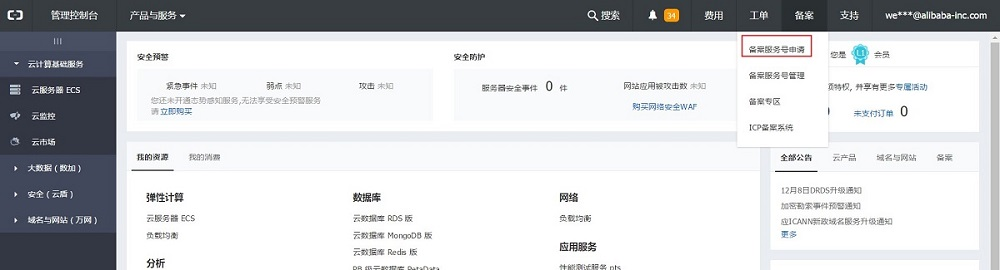
2、在备案服务号申请中的 ECS 产品类型中，选择您需要申请服务号的主机，并单击 申请 按钮。
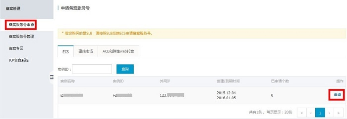
3、单击 确认，申请服务号
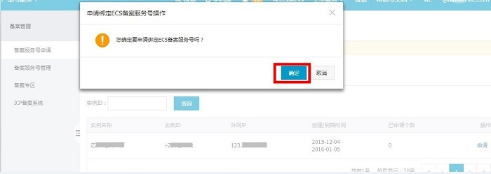
### 6、填写主体信息。

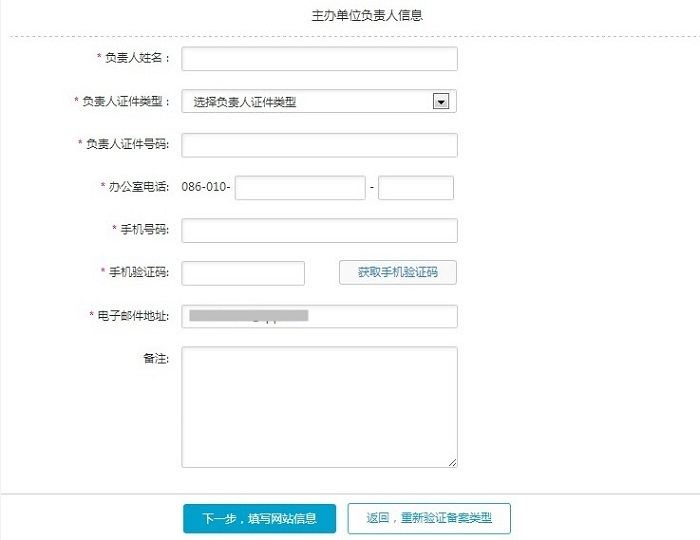
### 7、填写网站信息。
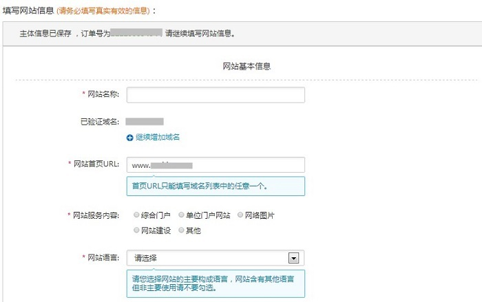
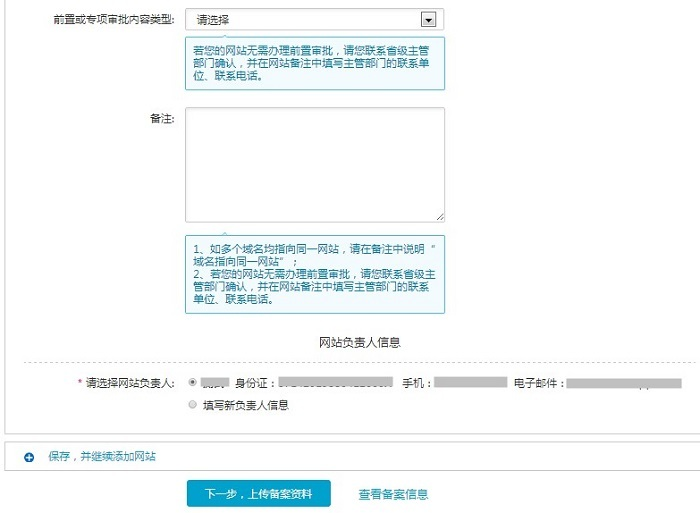
### 8、上传资料，单击 提交备案，信息将提交至阿里云审核。
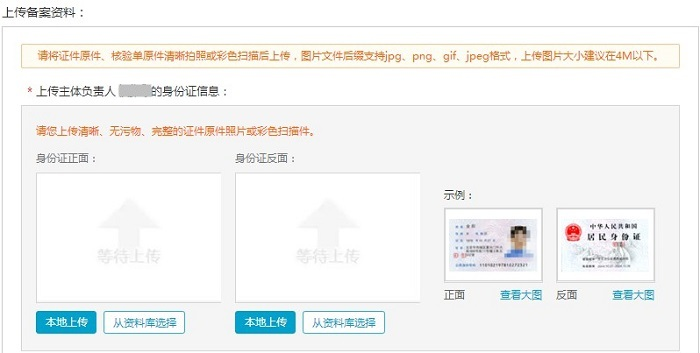
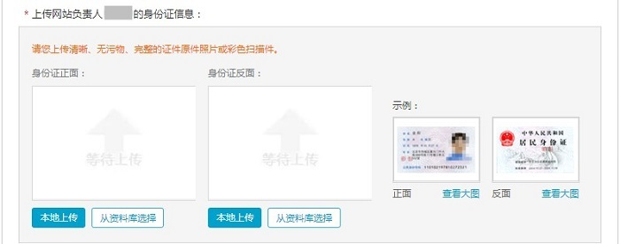
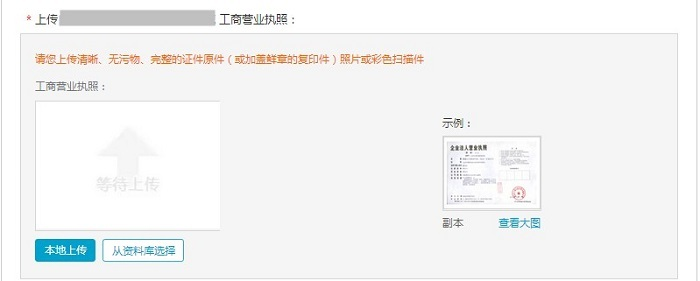
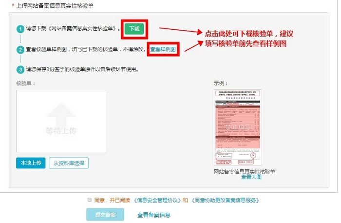
### 9、审核期间如遇到问题，会拨打您备案信息中的联系电话进行沟通，请保持电话畅通
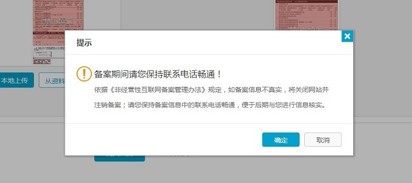
### 10、提交备案至初审，工作人员会在 1 个工作日内进行审核处理
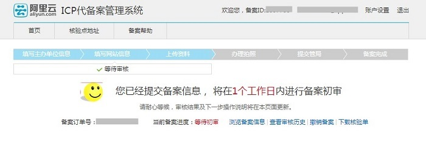
## 三、办理拍照流程说明
根据工信部要求，备案时还需提供网站负责人当面核验照片，您可在提交的订单阿里云初审通过后，登录备案系统首页提交幕布申请，并按照系统提示来进行幕布申请即可。
### 1、登录备案系统，单击申请幕布。

### 2、填写申请信息。
请填写真实准确的地址及联系方式，以便正常接收我们快递给您的幕布，另申请情况可在备案系统查询结果页面查看。（注：幕布邮寄仅支持中国大陆境内签收地址）
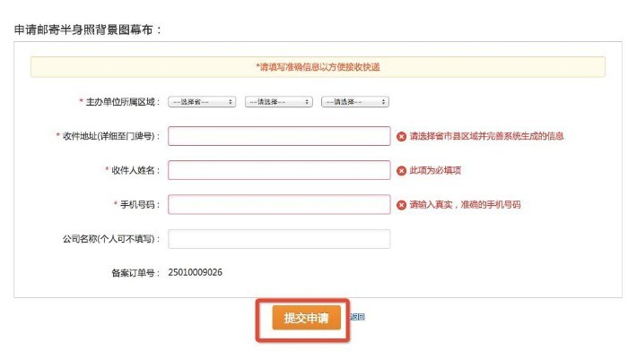
### 3、上传核验照片。
收到幕布拍照时，请先查看拍照说明，拍照完成可登录备案系统，单击上传照片将核验照片上传审核。
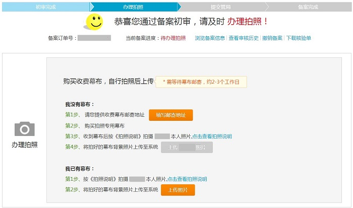
#### 拍照照片要求
拍照人必须与网站负责人为同一人。
负责人需站在背景幕布中间位置，身着当季服装拍摄上半身即可。
整个画面背景必须都是阿里云幕布，且为蓝色，显示效果幕布字迹清晰
请您避免身着红色或者蓝色上衣进行拍照。
照片拍摄完成上传后，阿里云会在 1 个工作日进行审核。审核通过后您会收到相应的短信邮件通知
样例如下：

## 四、管局审核过程
各地通管局的备案规则不一样，审核时间也不一样，单击此处查看各地管局规则。
若网站信息真实、完整、正确，各项信息完全符合填写要求，一般 20 个工作日左右会通过审核
通管局将以短信方式通知备案是否成功，并将备案号跟备案密码发到备案信息中主办单位负责人手机和邮箱中。
如果阿里云审核超过3个工作日了，请记录下您的备案ID（备案订单号）咨询备案专员。
阿里云备案专线电话：95187转3。

