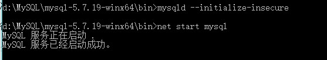

<!DOCTYPE html>
<html>
<head>
<meta charset="utf-8"> 
	
</head>

<body>
<h1>MinGW安装配置</h1>
<h2>1、从官网找到64位下载安装</h2>
<h3>2、在系统-环境变量里设置</h3>
<table>
<tr>在桌面找到我的电脑图标->右键->属性->高级系统设置->选择“高级”选项->选择下面“环境变量”->Administrator 的用户变量</tr>
<td></td>
</table>
<h4>3、验证是否配置成功</h4>
<table>
<tr>打开命令框输入：gcc -v，如果出现以下图像，则证明配置成功 </tr>           
<td></td>
</table>

<h1>MySQL安装配置</h1>
<h2>1、从官网下载mysql</h2>
<table>
	
	
	
	
</table>
<h3>2、安装mysql</h3>
<table>
	<tr>1、把 mysql-5.7.19-winx64.zip 压缩文件解压到 D:\MySQL\ 目录下；
        2、在 D:\MySQL\ 目录下新建 my.ini 配置文件；
        3、用文本编辑器或其他编辑器打开 my.ini 文件，把以下代码复制粘贴进去，保存退出；</tr>
	<td></td>
</table>
<h4>3、配置环境变量</h4>
<table>
	<tr>1、新建系统变量 MYSQL_HOME ，并配置变量值为 D:\MySQL\mysql-5.7.19-winx64 ；
        2、编辑系统变量 Path ，将 ;%MYSQL_HOME%\bin 添加到 Path 变量值后面。</tr>
        <td></td>
</table>
<h4>4、以管理员身份运行cmd.exe</h5>
<table>
	<tr>
	<td>1、运行以下指令</td></tr>
	<tr><td></td></tr>
	<tr><td>2、这时会出现以下问题</td></tr>
	<tr><td></td></tr>
	<tr><td>3、先进入D:\MySQL\mysql-5.7.19-winx64这个目录，然后运行以下指令,然后就启动成功了</td></tr>
	 <tr>    <td></td></tr>
</table>
<h4>5、修改mysql密码</h6>
<table>
	<tr><td>1、打开终端win+r输入cmd回车即可打开,进入目录后，输入mysql -uroot -p</td></tr>
	<tr><td></td></tr>
	<tr><td>2、接着输入set password for root@localhost = password('violet')</td></tr>
	<tr><td></td></tr>
</table>

</body>
</html>
