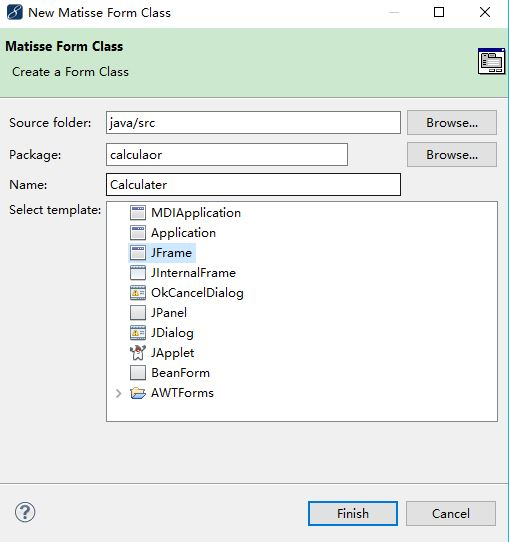
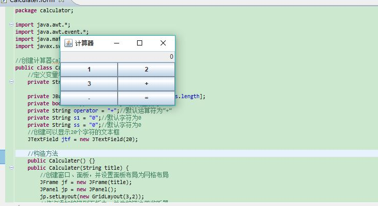
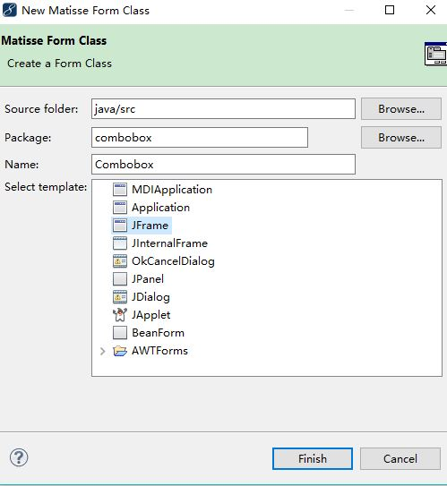

# JAVA界面制作计算器和下拉菜单
## 一、制作计算器新建文件。
先打开File的new ，进入JAVA project,写project name,就会生成一个src。然后在右键点击新建包的名字和表格名。

## 二、书写计算器的代码
package calculator;

import java.awt.*;
import java.awt.event.*;
import java.math.BigDecimal;
import javax.swing.*;
 
//创建计算器Calculater类，实现ActionListener接口
public class Calculater implements ActionListener {
    //定义变量和按钮数组
    private String[] names ={"1","2","3","+","-","="
                             };
    private JButton[] buttonArray = new JButton[names.length];
    private boolean append = false;//默认追加为false
    private String operator = "+";//默认运算符为“+”
    private String s1 = "0";//默认字符为0
    private String ss = "0";//默认字符为0
    //创建可以显示20个字符的文本框
    JTextField jtf = new JTextField(20);
 
    //构造方法
    public Calculater() {}
    public Calculater(String title) {
        //创建窗口、面板，并设置面板布局为网格布局
        JFrame jf = new JFrame(title);
        JPanel jp = new JPanel();
        jp.setLayout(new GridLayout(3,2));
        //依次添加按钮到面板中，并为按钮注册监听器
        for (int i = 0; i < buttonArray.length; i++) {
            buttonArray[i] = new JButton(names[i]);
            buttonArray[i].addActionListener(this);
            jp.add(buttonArray[i]);
        }
        //添加文本框到窗体中
        jf.add(jtf,BorderLayout.NORTH);
        jf.add(jp);//添加面板到窗体中
        jtf.setHorizontalAlignment(JTextField.RIGHT);//设置文本框的水平方向为右
        jtf.setText("0");//设置初始文本为0
        jtf.setEditable(false);//设置文本框为不可编辑状态
        //设置窗体属性
        jf.pack();//系统自动设置大小和位置
        jf.setVisible(true);
        jf.setDefaultCloseOperation(JFrame.EXIT_ON_CLOSE);
    }
 
    //实现监听接口的actionPerformed方法
    public void actionPerformed(ActionEvent e) {
        String comm = e.getActionCommand();
        if(comm.matches("\\d")) { //用正则表达式判断输出的是否是0~9
            if(append) { //如果是，追加显示
                String temp = jtf.getText();
                jtf.setText(temp + comm);
            } else { //如果不是，显示该字符并将追加设置为true
                jtf.setText(comm);
                append = true;
            }
        } else if(comm.equals(".")) { //输入小数点时
            String temp = jtf.getText();
            if(temp.indexOf(".")== -1 && append) { //当输入的文本中没有小数点时
                jtf.setText(temp+comm);
                append = true;                    //输入小数点后继续追加
            } else if(!append) { //当字符串开始时候先输入 " . " 则直接输出" 0. "
                jtf.setText("0"+comm);
                append = true;
            }
        } else if("+-".indexOf(comm)!= -1) { //输入加减符号时，
            //以下运算应该注意数据类型，尤其是大数字和浮点数及int数在运算中的区别
            operator = comm;
            s1 = jtf.getText();
            double d3 = Double.parseDouble(s1);
            double d4 = Double.parseDouble(ss);
            BigDecimal bd3 = new BigDecimal(d3+"");
            BigDecimal bd4 = new BigDecimal(d4+"");
            if(operator.equals("+")) { //加法时
                d3 = bd3.add(bd4).doubleValue();
                ss = d3+"";
                jtf.setText(ss);
            } else if(operator.equals("-")) { //减法时
                if(d4 == 0.0) {
                    ss = s1;
                    jtf.setText(ss);
                } else {
                    d3 = bd4.subtract(bd3).doubleValue();
                    ss = d3+"";
                    jtf.setText(ss);
                }
            } else if(operator.equals("*")) { //乘法时
                if(d4 == 0.0) {
                    ss = s1;
                    jtf.setText(ss);
                } else {
                    d3 = bd3.multiply(bd4).doubleValue();
                    ss = d3+"";
                    jtf.setText(ss);
                }
            } else if(operator.equals("/")) { //除法时
                if(d4 == 0.0) {
                    ss = s1;
                    jtf.setText(s1);
                } else {
                    d3 = bd4.divide(bd3,15,BigDecimal.ROUND_HALF_UP).doubleValue();
                }
                ss = d3+"";
                jtf.setText(ss);
            }
            append = false;       //不继续追加
        } else if(comm.equals("=")) { //输入等号时，计算加减乘除的结果
            String s2 = jtf.getText();
            double d1 = Double.parseDouble(ss);
            double d2 = Double.parseDouble(s2);
            BigDecimal bd1 = new BigDecimal(d1+"");
            BigDecimal bd2 = new BigDecimal(d2+"");
            if(operator.equals("+")) {
                d1 = bd1.add(bd2).doubleValue();
            } else if(operator.equals("-")) {
                d1 = bd1.subtract(bd2).doubleValue();
            } else if(operator.equals("*")) {
                d1 = bd1.multiply(bd2).doubleValue();
            } else if(operator.equals("/")) { //精确计算浮点除法
                if(d2!=0.0) {
                    d1 = bd1.divide(bd2,15,BigDecimal.ROUND_HALF_UP).doubleValue();
                }
            }
            ss = "0";
            jtf.setText(d1+"");
            append = false;   //不继续追加
        } else if(comm.equals("CE")||comm.equals("C")) { //输入CE或C时
            jtf.setText("0");
            ss = "0";
            append = false;
        } else if(comm.equals("+/-")) { //改变数值的正负号
            String temp = jtf.getText();
            if(!append) {
                jtf.setText("-");
                append = true;
            } else if(temp.startsWith("-")) { //如果字符串以负号开头
                jtf.setText(temp.substring(1));
            } else {
                jtf.setText("-" + temp);
            }
        } else if(comm.equals("Backspace")) { //输入Backspace时，退回一个字符
            String temp = jtf.getText();
            if(temp.length()>0)
                jtf.setText(temp.substring(0,temp.length()-1));
        }
    }
    //主方法
    public static void main(String[] args) {
        //创建名为Calculator的计算器对象
        new Calculater("计算器");
    }
}
## 三、运行程序

## 一、下拉菜单 新建文件

## 二、书写程序
package combobox;

import java.awt.Color;

/*
 * ComboBox2.java
 *
 * Created on __DATE__, __TIME__
 */

/**
 *
 * @author  __USER__
 */
public class Combobox extends javax.swing.JFrame {

	/** Creates new form ComboBox2 */
	public Combobox() {
		initComponents();
	}

	/** This method is called from within the constructor to
	 * initialize the form.
	 * WARNING: Do NOT modify this code. The content of this method is
	 * always regenerated by the Form Editor.
	 */
	//GEN-BEGIN:initComponents
	// <editor-fold defaultstate="collapsed" desc="Generated Code">
	private void initComponents() {

		jComboBox1 = new javax.swing.JComboBox();

		setDefaultCloseOperation(javax.swing.WindowConstants.EXIT_ON_CLOSE);

		jComboBox1.setModel(new javax.swing.DefaultComboBoxModel(new String[] {
				"灰色", "粉色", "绿色" }));
		jComboBox1.addActionListener(new java.awt.event.ActionListener() {
			public void actionPerformed(java.awt.event.ActionEvent evt) {
				jComboBox1ActionPerformed(evt);
			}
		});

		javax.swing.GroupLayout layout = new javax.swing.GroupLayout(
				getContentPane());
		getContentPane().setLayout(layout);
		layout.setHorizontalGroup(layout.createParallelGroup(
				javax.swing.GroupLayout.Alignment.LEADING).addGroup(
				layout.createSequentialGroup()
						.addGap(137, 137, 137)
						.addComponent(jComboBox1,
								javax.swing.GroupLayout.PREFERRED_SIZE,
								javax.swing.GroupLayout.DEFAULT_SIZE,
								javax.swing.GroupLayout.PREFERRED_SIZE)
						.addContainerGap(211, Short.MAX_VALUE)));
		layout.setVerticalGroup(layout.createParallelGroup(
				javax.swing.GroupLayout.Alignment.LEADING).addGroup(
				layout.createSequentialGroup()
						.addGap(65, 65, 65)
						.addComponent(jComboBox1,
								javax.swing.GroupLayout.PREFERRED_SIZE,
								javax.swing.GroupLayout.DEFAULT_SIZE,
								javax.swing.GroupLayout.PREFERRED_SIZE)
						.addContainerGap(212, Short.MAX_VALUE)));

		pack();
	}// </editor-fold>
	//GEN-END:initComponents

	private void jComboBox1ActionPerformed(java.awt.event.ActionEvent evt) {
		// TODO add your handling code here:
		if(jComboBox1.getSelectedIndex()==0){
			this.getContentPane().setBackground(Color.gray);
			
			}
			else if(jComboBox1.getSelectedIndex()==1){
				this.getContentPane().setBackground(Color.pink);
				
			}
			  
			     else {
			    	    this.getContentPane().setBackground(Color.green);
			     }
	}

	/**
	 * @param args the command line arguments
	 */
	public static void main(String args[]) {
		java.awt.EventQueue.invokeLater(new Runnable() {
			public void run() {
				new Combobox().setVisible(true);
			}
		});
	}

	//GEN-BEGIN:variables
	// Variables declaration - do not modify
	private javax.swing.JComboBox jComboBox1;
	// End of variables declaration//GEN-END:variables

}
## 三、运行程序

