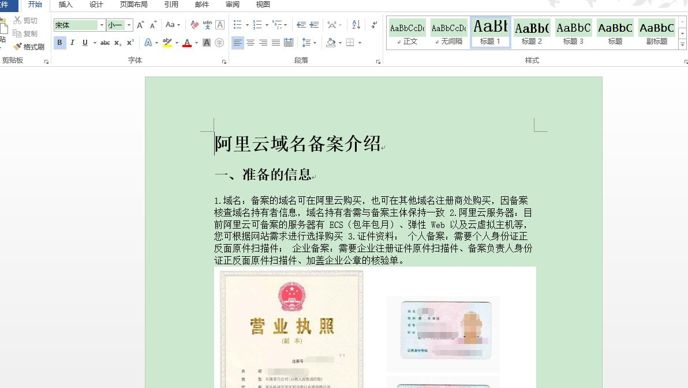

# 将md格式文件转换为pdf和doc格式

## 一、转换为pdf格式

将md格式文件在浏览器打开，然后找到打印选项

然后就能生成pdf格式的文件了

## 二、转换为doc格式

在浏览器搜索Pandoc镜像并安装于电脑，然后配置环境变量再重启。
然后将md格式文件的内容全部复制于安装pandoc的文件里

打开cmd，配置pandoc -s -o record.doc README.md

就可以生成doc格式文件

