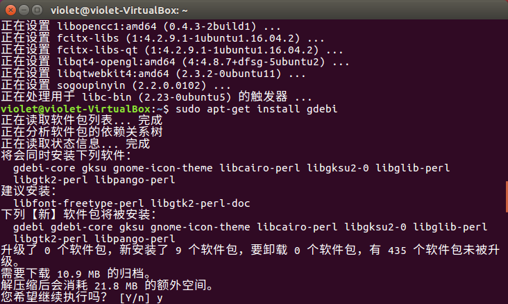

# Ubuntu 安装搜狗拼音

## 记录安装搜狗拼音时出现的一些问题

1.在浏览器搜索sogou for linux，然后在官网下载64位后缀名位deb的安装包。

2.双击安装包但是却无法安装，因为软件源的问题

3.在终端输入```sudo apt-get install gdebi```

发现有未能满足的依赖关系

4.然后接着输入```sudo apt-get update```

还是有未能满足的依赖关系


5.然后输入```sudo apt-get -f install```


6.这时候输入```sudo apt-get install gdebi```



这时候就已经成功了

7.找到安装搜狗拼音安装包的位置

```ls``` 是所有文件夹

```cd 下载``` 是文件夹路径

再输入```sudo gdebi sogoupinyin-2.2.0.0102_amd64.deb```


接着输入```Y```就安装成功了


